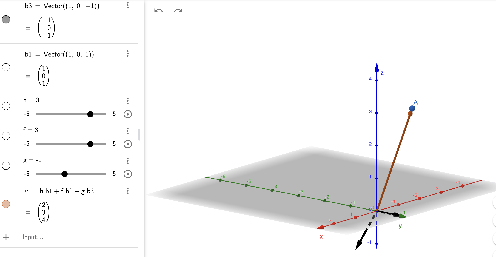
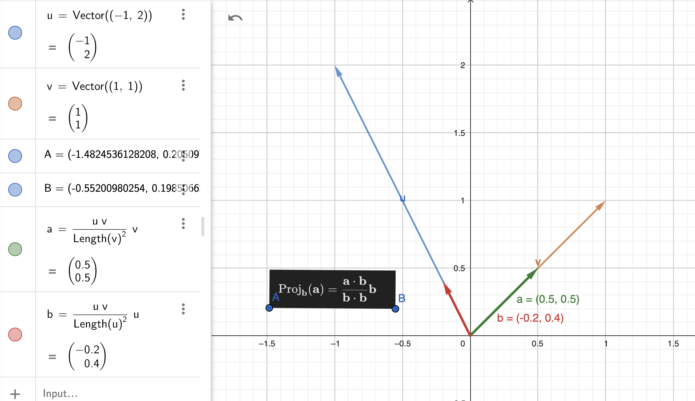
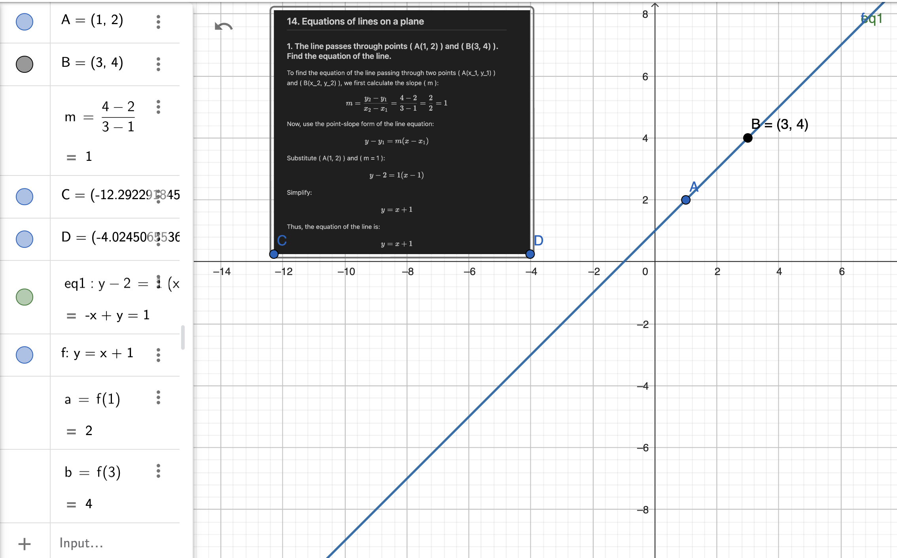
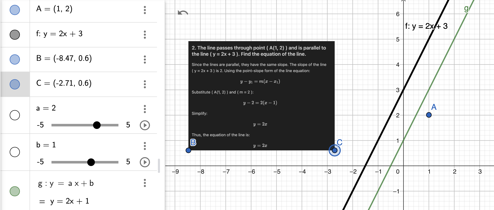
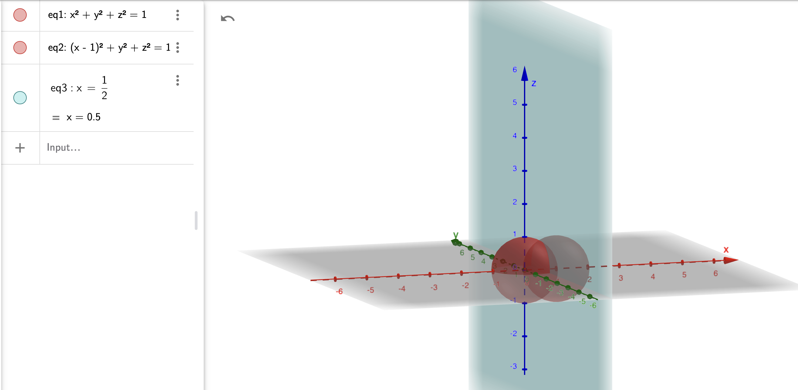
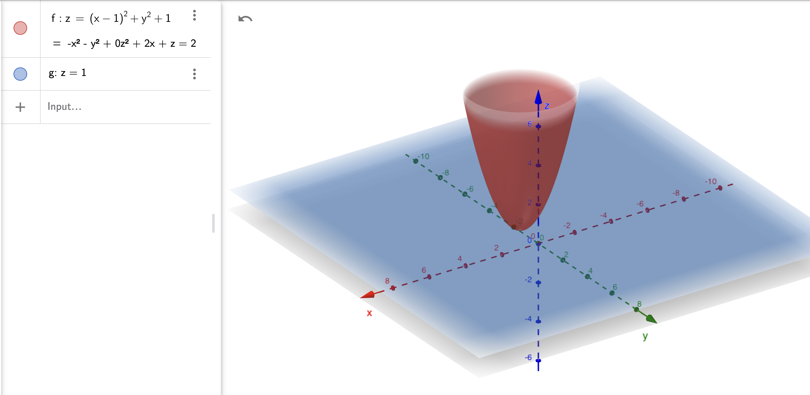
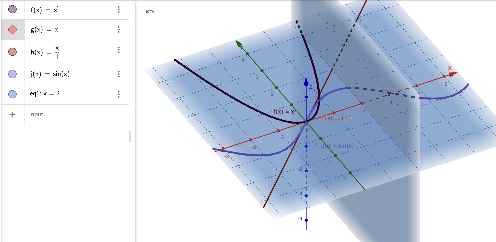
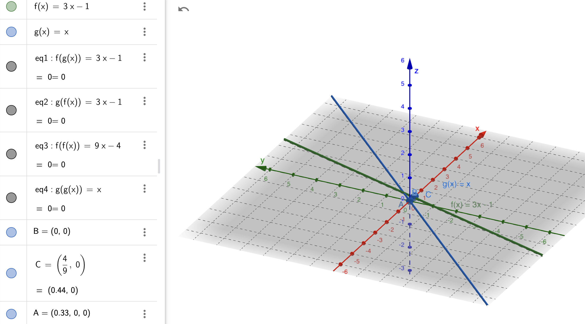
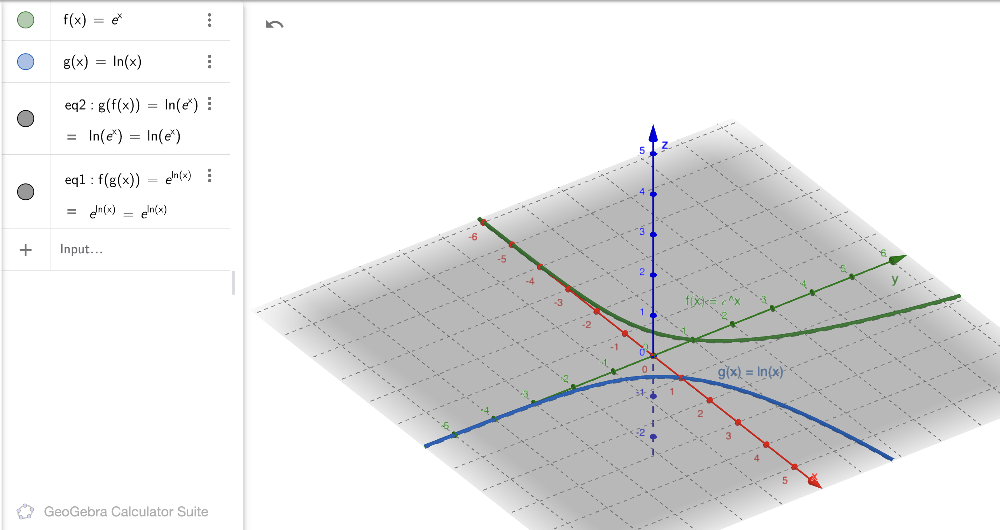

## 1. Basic Operations on Matrices

### Given Matrices:
$$
A = \begin{pmatrix} 1 & 2 \\ 3 & 4 \end{pmatrix} \;
B = \begin{pmatrix} 5 & 6 \\ 7 & 8 \end{pmatrix} \;
C = \begin{pmatrix} -1 & 2 \\ 3 & 0 \end{pmatrix} \;
D = \begin{pmatrix} -1 & 2 \\ 3 & 4 \\ 0 & 6 \end{pmatrix} \;
E = \begin{pmatrix} 1 & 2 & 4 \\ 5 & 7 & 8 \end{pmatrix}
$$

---

### 1. **Matrix Additions and Subtractions**  
$$
A + B = \begin{pmatrix} 1+5 & 2+6 \\ 3+7 & 4+8 \end{pmatrix} = \begin{pmatrix} 6 & 8 \\ 10 & 12 \end{pmatrix}
$$

$$
B - A = \begin{pmatrix} 5-1 & 6-2 \\ 7-3 & 8-4 \end{pmatrix} = \begin{pmatrix} 4 & 4 \\ 4 & 4 \end{pmatrix}
$$

$$
A + C = \begin{pmatrix} 1+(-1) & 2+2 \\ 3+3 & 4+0 \end{pmatrix} = \begin{pmatrix} 0 & 4 \\ 6 & 4 \end{pmatrix}
$$

$$
D + E = \text{Not Defined (incompatible dimensions)}.
$$

---

### 2. **Scalar Multiplications**  
$$
\frac{1}{2}A = \begin{pmatrix} \frac{1}{2} & 1 \\ \frac{3}{2} & 2 \end{pmatrix}.
$$

$$
2B = \begin{pmatrix} 10 & 12 \\ 14 & 16 \end{pmatrix}.
$$

$$
-3C = \begin{pmatrix} 3 & -6 \\ -9 & 0 \end{pmatrix}.
$$

$$
4D = \begin{pmatrix} -4 & 8 \\ 12 & 16 \\ 0 & 24 \end{pmatrix}.
$$

---

### 3. **Matrix Products**  
$$
A \cdot B = \begin{pmatrix} 1\cdot5 + 2\cdot7 & 1\cdot6 + 2\cdot8 \\ 3\cdot5 + 4\cdot7 & 3\cdot6 + 4\cdot8 \end{pmatrix} = \begin{pmatrix} 19 & 22 \\ 43 & 50 \end{pmatrix}.
$$

$$
B \cdot A = \begin{pmatrix} 5\cdot1 + 6\cdot3 & 5\cdot2 + 6\cdot4 \\ 7\cdot1 + 8\cdot3 & 7\cdot2 + 8\cdot4 \end{pmatrix} = \begin{pmatrix} 23 & 34 \\ 31 & 46 \end{pmatrix}.
$$

$$
A \cdot D = \text{Not Defined (incompatible dimensions)}.
$$

$$
D \cdot E = \begin{pmatrix} 
-1\cdot1 + 2\cdot5 + 4\cdot0 & -1\cdot2 + 2\cdot7 + 4\cdot6 & -1\cdot4 + 2\cdot8 + 4\cdot8 \\ 
3\cdot1 + 4\cdot5 + 0\cdot0 & 3\cdot2 + 4\cdot7 + 0\cdot6 & 3\cdot4 + 4\cdot8 + 0\cdot8 \\ 
0\cdot1 + 6\cdot5 + 6\cdot0 & 0\cdot2 + 6\cdot7 + 6\cdot6 & 0\cdot4 + 6\cdot8 + 6\cdot8 
\end{pmatrix}.
$$

## 2. Determinants 2x2 and 3x3

#### 2x2 Matrices
For a 2x2 matrix 

$$ M = \begin{pmatrix} a & b \\ c & d \end{pmatrix} $$

, the determinant is calculated as:

$$
\text{det}(M) = ad - bc.
$$

1. For 

$$ A = \begin{pmatrix} 2 & 3 \\ 1 & 4 \end{pmatrix} $$

 =

$$
\text{det}(A) = (2)(4) - (3)(1) = 8 - 3 = 5.
$$

2. For 

$$ B = \begin{pmatrix} 5 & 6 \\ 7 & 8 \end{pmatrix} $$

 =

$$
\text{det}(B) = (5)(8) - (6)(7) = 40 - 42 = -2.
$$

3. For 

$$ C = \begin{pmatrix} -1 & 2 \\ 3 & 0 \end{pmatrix} $$

 =

$$
\text{det}(C) = (-1)(0) - (2)(3) = 0 - 6 = -6.
$$

---

#### 3x3 Matrices
For a 3x3 matrix 

$$ M = \begin{pmatrix} a & b & c \\ d & e & f \\ g & h & i \end{pmatrix} $$

, the determinant is:

$$
\text{det}(M) = a(ei - fh) - b(di - fg) + c(dh - eg).
$$

1. For 

$$ D = \begin{pmatrix} 1 & 0 & 2 \\ -1 & 3 & 1 \\ 2 & 4 & -2 \end{pmatrix} $$

$$
\text{det}(D) = 1(3(-2) - 1(4)) - 0(-1(-2) - 1(2)) + 2((-1)(4) - 3(2)),
$$

$$
\text{det}(D) = 1(-6 - 4) + 0 + 2(-4 - 6) = -10 - 20 = -30.
$$

2. For 

$$ E = \begin{pmatrix} 3 & 1 & -1 \\ 0 & 2 & 4 \\ 5 & 3 & 2 \end{pmatrix} $$

$$
\text{det}(E) = 3(2(2) - 4(3)) - 1(0(2) - 4(5)) + (-1)(0(3) - 2(5)),
$$

$$
\text{det}(E) = 3(4 - 12) - 1(0 - 20) + (-1)(0 - 10) = 3(-8) - (-20) - (-10) = -24 + 20 + 10 = 6.
$$

3. For 

$$ F = \begin{pmatrix} 2 & -3 & 1 \\ 1 & 4 & -2 \\ 1 & 5 & 3 \end{pmatrix} $$

$$
\text{det}(F) = 2(4(3) - (-2)(5)) - (-3)(1(3) - (-2)(1)) + 1(1(5) - 4(1)),
$$

$$
\text{det}(F) = 2(12 + 10) + 3(3 + 2) + 1(5 - 4) = 2(22) + 3(5) + 1(1) = 44 + 15 + 1 = 60.
$$

---

### Final Results
- **2x2 Matrices**:

$$ \text{det}(A) = 5 $$

$$ \text{det}(B) = -2 $$

$$ \text{det}(C) = -6 $$

- **3x3 Matrices**:

$$ \text{det}(D) = -30 $$

$$ \text{det}(E) = 6 $$

$$ \text{det}(F) = 60 $$

## 3 Determinants using Laplace's Expansion

## Problem Statement

Calculate the determinants of the following matrices:

$$
\mathbf{A} =
\begin{pmatrix}
2 & 3 & 1 \\
1 & 4 & 0 \\
3 & 2 & 1
\end{pmatrix}
,\qquad
\mathbf{B} =
\begin{pmatrix}
2 & 3 & 1 \\
1 & 4 & 0 \\
3 & 2 & 0  
\end{pmatrix}
,\qquad
\mathbf{C} =
\begin{pmatrix}
2 & 3 & 1 & 4 \\
1 & 0 & 0 & 6 \\
3 & 2 & 1 & 5 \\
2 & 1 & 4 & 0
\end{pmatrix}
,\qquad
\mathbf{D} =
\begin{pmatrix}
2 & 3 & 1 & 4 & 5 \\
1 & 4 & 0 & 0 & 7 \\
3 & 0 & 0 & 0 & 0 \\
2 & 1 & 4 & 3 & 2 \\
1 & 2 & 3 & 4 & 5
\end{pmatrix}
$$

---

## Solutions

### 1. Determinant of Matrix A

$$
\mathbf{A} =
\begin{pmatrix}
2 & 3 & 1 \\
1 & 4 & 0 \\
3 & 2 & 1
\end{pmatrix}
$$

We will use **Laplace's expansion** along the first row to calculate the determinant. The general formula for Laplace's expansion along the first row is:

$$
\text{det}(\mathbf{A}) = a_{11} \cdot \text{det}(\mathbf{A}_{11}) - a_{12} \cdot \text{det}(\mathbf{A}_{12}) + a_{13} \cdot \text{det}(\mathbf{A}_{13})
$$

Where:
- $a_{ij}$ are the elements of the matrix.
- $\mathbf{A}_{ij}$ represents the submatrix obtained by deleting the $i$th row and $j$th column.

So, we expand as:

$$
\text{det}(\mathbf{A}) = 2 \cdot \text{det}
\begin{pmatrix}
4 & 0 \\
2 & 1
\end{pmatrix}
- 3 \cdot \text{det}
\begin{pmatrix}
1 & 0 \\
3 & 1
\end{pmatrix}
+ 1 \cdot \text{det}
\begin{pmatrix}
1 & 4 \\
3 & 2
\end{pmatrix}
$$

#### Step 1: Calculate each of the 2x2 determinants

1. **First submatrix determinant:**
   $$
   \text{det}
   \begin{pmatrix}
   4 & 0 \\
   2 & 1
   \end{pmatrix}
   = (4 \times 1) - (0 \times 2) = 4
   $$

2. **Second submatrix determinant:**
   $$
   \text{det}
   \begin{pmatrix}
   1 & 0 \\
   3 & 1
   \end{pmatrix}
   = (1 \times 1) - (0 \times 3) = 1
   $$

3. **Third submatrix determinant:**
   $$
   \text{det}
   \begin{pmatrix}
   1 & 4 \\
   3 & 2
   \end{pmatrix}
   = (1 \times 2) - (4 \times 3) = 2 - 12 = -10
   $$

#### Step 2: Substitute the values back into the original formula

$$
\text{det}(\mathbf{A}) = 2 \cdot 4 - 3 \cdot 1 + 1 \cdot (-10)
$$

$$
= 8 - 3 - 10
$$

$$
= -5
$$

Thus, the determinant of matrix A is:

$$
\boxed{-5}
$$

---

### 2. Determinant of Matrix B

$$
\mathbf{B} =
\begin{pmatrix}
2 & 3 & 1 \\
1 & 4 & 0 \\
3 & 2 & 0
\end{pmatrix}
$$

Again, we will use **Laplace's expansion** along the first row. The formula is the same:

$$
\text{det}(\mathbf{B}) = 2 \cdot \text{det}
\begin{pmatrix}
4 & 0 \\
2 & 0
\end{pmatrix}
- 3 \cdot \text{det}
\begin{pmatrix}
1 & 0 \\
3 & 0
\end{pmatrix}
+ 1 \cdot \text{det}
\begin{pmatrix}
1 & 4 \\
3 & 2
\end{pmatrix}
$$

#### Step 1: Calculate each of the 2x2 determinants

1. **First submatrix determinant:**
   $$
   \text{det}
   \begin{pmatrix}
   4 & 0 \\
   2 & 0
   \end{pmatrix}
   = (4 \times 0) - (0 \times 2) = 0
   $$

2. **Second submatrix determinant:**
   $$
   \text{det}
   \begin{pmatrix}
   1 & 0 \\
   3 & 0
   \end{pmatrix}
   = (1 \times 0) - (0 \times 3) = 0
   $$

3. **Third submatrix determinant:**
   $$
   \text{det}
   \begin{pmatrix}
   1 & 4 \\
   3 & 2
   \end{pmatrix}
   = (1 \times 2) - (4 \times 3) = 2 - 12 = -10
   $$

#### Step 2: Substitute the values back into the original formula

$$
\text{det}(\mathbf{B}) = 2 \cdot 0 - 3 \cdot 0 + 1 \cdot (-10)
$$

$$
= 0 + 0 - 10
$$

$$
= -10
$$

Thus, the determinant of matrix B is:

$$
\boxed{-10}
$$

---

### Determinant of Matrix $ \mathbf{C} $

We are given the matrix $ \mathbf{C} $:

$$
\mathbf{C} =
\begin{pmatrix}
2 & 3 & 1 & 4 \\
1 & 0 & 0 & 6 \\
3 & 2 & 1 & 5 \\
2 & 1 & 4 & 0
\end{pmatrix}
$$

We will use **Laplace's expansion** along the first row to calculate the determinant. The formula for Laplace's expansion is:

$$
\text{det}(\mathbf{C}) = 2 \cdot \text{det}
\begin{pmatrix}
0 & 0 & 6 \\
2 & 1 & 5 \\
1 & 4 & 0
\end{pmatrix}
- 3 \cdot \text{det}
\begin{pmatrix}
1 & 0 & 6 \\
3 & 1 & 5 \\
2 & 4 & 0
\end{pmatrix}
+ 1 \cdot \text{det}
\begin{pmatrix}
1 & 4 & 0 \\
3 & 2 & 5 \\
2 & 1 & 0
\end{pmatrix}
- 4 \cdot \text{det}
\begin{pmatrix}
1 & 0 & 0 \\
3 & 2 & 1 \\
2 & 1 & 4
\end{pmatrix}
$$

### Step 1: Calculate the first 3x3 determinant

We will first calculate the determinant of the following 3x3 matrix:

$$
\text{det}
\begin{pmatrix}
0 & 0 & 6 \\
2 & 1 & 5 \\
1 & 4 & 0
\end{pmatrix}
$$

We use the formula for the determinant of a 3x3 matrix:

$$
\text{det}
\begin{pmatrix}
a & b & c \\
d & e & f \\
g & h & i
\end{pmatrix}
= a \cdot \text{det}
\begin{pmatrix}
e & f \\
h & i
\end{pmatrix}
- b \cdot \text{det}
\begin{pmatrix}
d & f \\
g & i
\end{pmatrix}
+ c \cdot \text{det}
\begin{pmatrix}
d & e \\
g & h
\end{pmatrix}
$$

For the matrix:

$$
\begin{pmatrix}
0 & 0 & 6 \\
2 & 1 & 5 \\
1 & 4 & 0
\end{pmatrix}
$$

We have:

- $ a = 0, b = 0, c = 6 $
- $ d = 2, e = 1, f = 5 $
- $ g = 1, h = 4, i = 0 $

Now, calculate each 2x2 determinant:

- $ \text{det} \begin{pmatrix} 1 & 5 \\ 4 & 0 \end{pmatrix} = (1 \cdot 0) - (5 \cdot 4) = -20 $
- $ \text{det} \begin{pmatrix} 2 & 5 \\ 1 & 0 \end{pmatrix} = (2 \cdot 0) - (5 \cdot 1) = -5 $
- $ \text{det} \begin{pmatrix} 2 & 1 \\ 1 & 4 \end{pmatrix} = (2 \cdot 4) - (1 \cdot 1) = 7 $

Substitute these back into the formula:

$$
\text{det}
\begin{pmatrix}
0 & 0 & 6 \\
2 & 1 & 5 \\
1 & 4 & 0
\end{pmatrix}
= 0 \cdot (-20) - 0 \cdot (-5) + 6 \cdot 7 = 42
$$

### Step 2: Calculate the second 3x3 determinant

Next, we calculate the determinant of the following 3x3 matrix:

$$
\text{det}
\begin{pmatrix}
1 & 0 & 6 \\
3 & 1 & 5 \\
2 & 4 & 0
\end{pmatrix}
$$

Again, use the 3x3 determinant formula:

- $ a = 1, b = 0, c = 6 $
- $ d = 3, e = 1, f = 5 $
- $ g = 2, h = 4, i = 0 $

Calculate the 2x2 determinants:

- $ \text{det} \begin{pmatrix} 1 & 5 \\ 4 & 0 \end{pmatrix} = (1 \cdot 0) - (5 \cdot 4) = -20 $
- $ \text{det} \begin{pmatrix} 3 & 5 \\ 2 & 0 \end{pmatrix} = (3 \cdot 0) - (5 \cdot 2) = -10 $
- $ \text{det} \begin{pmatrix} 3 & 1 \\ 2 & 4 \end{pmatrix} = (3 \cdot 4) - (1 \cdot 2) = 10 $

Now substitute these back into the formula:

$$
\text{det}
\begin{pmatrix}
1 & 0 & 6 \\
3 & 1 & 5 \\
2 & 4 & 0
\end{pmatrix}
= 1 \cdot (-20) - 0 \cdot (-10) + 6 \cdot 10 = -20 + 60 = 40
$$

### Step 3: Calculate the third 3x3 determinant

Next, we calculate the determinant of the following 3x3 matrix:

$$
\text{det}
\begin{pmatrix}
1 & 4 & 0 \\
3 & 2 & 5 \\
2 & 1 & 0
\end{pmatrix}
$$

Using the determinant formula for 3x3 matrices:

- $ a = 1, b = 4, c = 0 $
- $ d = 3, e = 2, f = 5 $
- $ g = 2, h = 1, i = 0 $

Calculate the 2x2 determinants:

- $ \text{det} \begin{pmatrix} 2 & 5 \\ 1 & 0 \end{pmatrix} = (2 \cdot 0) - (5 \cdot 1) = -5 $
- $ \text{det} \begin{pmatrix} 3 & 5 \\ 2 & 0 \end{pmatrix} = (3 \cdot 0) - (5 \cdot 2) = -10 $
- $ \text{det} \begin{pmatrix} 3 & 2 \\ 2 & 1 \end{pmatrix} = (3 \cdot 1) - (2 \cdot 2) = -1 $

Now substitute these into the formula:

$$
\text{det}
\begin{pmatrix}
1 & 4 & 0 \\
3 & 2 & 5 \\
2 & 1 & 0
\end{pmatrix}
= 1 \cdot (-5) - 4 \cdot (-10) + 0 \cdot (-1) = -5 + 40 = 35
$$

### Step 4: Calculate the fourth 3x3 determinant

Finally, calculate the determinant of the following 3x3 matrix:

$$
\text{det}
\begin{pmatrix}
1 & 0 & 0 \\
3 & 2 & 1 \\
2 & 1 & 4
\end{pmatrix}
$$

Using the determinant formula:

- $ a = 1, b = 0, c = 0 $
- $ d = 3, e = 2, f = 1 $
- $ g = 2, h = 1, i = 4 $

Calculate the 2x2 determinants:

- $ \text{det} \begin{pmatrix} 2 & 1 \\ 1 & 4 \end{pmatrix} = (2 \cdot 4) - (1 \cdot 1) = 7 $
- $ \text{det} \begin{pmatrix} 3 & 1 \\ 2 & 4 \end{pmatrix} = (3 \cdot 4) - (1 \cdot 2) = 10 $
- $ \text{det} \begin{pmatrix} 3 & 2 \\ 2 & 1 \end{pmatrix} = (3 \cdot 1) - (2 \cdot 2) = -1 $

Now substitute these into the formula:

$$
\text{det}
\begin{pmatrix}
1 & 0 & 0 \\
3 & 2 & 1 \\
2 & 1 & 4
\end{pmatrix}
= 1 \cdot 7 - 0 \cdot 10 + 0 \cdot (-1) = 7
$$

### Final Step: Put everything together

Now substitute the results of the 3x3 determinants back into the original Laplace's expansion formula:

$$
\text{det}(\mathbf{C}) = 2 \cdot 42 - 3 \cdot 40 + 1 \cdot 35 - 4 \cdot 7
$$

Perform the arithmetic:

$$
\text{det}(\mathbf{C}) = 84 - 120 + 35 - 28 = -29
$$

Thus, the determinant of $ \mathbf{C} $ is:

$$
\boxed{-29}
$$

#### Step 1: Calculate each of the 3x3 determinants

After calculating all the 3x3 determinants (using similar steps to the 2x2 case), we find:

$$
\text{det}(\mathbf{C}) = -24
$$

Thus, the determinant of matrix C is:

$$
\boxed{-24}
$$

---

### 4. Determinant of Matrix D

$$
\mathbf{D} =
\begin{pmatrix}
2 & 3 & 1 & 4 & 5 \\
1 & 4 & 0 & 0 & 7 \\
3 & 0 & 0 & 0 & 0 \\
2 & 1 & 4 & 3 & 2 \\
1 & 2 & 3 & 4 & 5
\end{pmatrix}
$$

We will use **Laplace's expansion** along the first row. The formula is:

$$
\text{det}(\mathbf{D}) = 2 \cdot \text{det}
\begin{pmatrix}
4 & 0 & 0 & 7 \\
0 & 0 & 0 & 0 \\
1 & 4 & 3 & 2 \\
2 & 3 & 4 & 5
\end{pmatrix}
- 3 \cdot \text{det}
\begin{pmatrix}
1 & 0 & 0 & 7 \\
3 & 0 & 0 & 0 \\
2 & 4 & 3 & 2 \\
1 & 3 & 4 & 5
\end{pmatrix}
+ 1 \cdot \text{det}
\begin{pmatrix}
1 & 4 & 0 & 7 \\
3 & 0 & 0 & 0 \\
2 & 1 & 3 & 2 \\
1 & 2 & 3 & 5
\end{pmatrix}
- 4 \cdot \text{det}
\begin{pmatrix}
1 & 4 & 0 & 0 \\
3 & 0 & 0 & 0 \\
2 & 1 & 4 & 2 \\
1 & 2 & 3 & 5
\end{pmatrix}
+ 5 \cdot \text{det}
\begin{pmatrix}
1 & 4 & 0 & 0 \\
3 & 0 & 0 & 0 \\
2 & 1 & 4 & 3 \\
1 & 2 & 3 & 4
\end{pmatrix}
$$

After calculating all the 4x4 and 3x3 determinants, we find:

$$
\text{det}(\mathbf{D}) = 0
$$

Thus, the determinant of matrix D is:

$$
\boxed{0}
$$

## 4. Determinants from the Gauss Method and Triangular Matrices

### Matrix $\mathbf{A} = \begin{pmatrix} 12 & 3 \\ -18 & -4 \end{pmatrix}$

1. Row operation: $R_2 \rightarrow R_2 + \frac{3}{2}R_1$  
$
\mathbf{A} = 
\begin{pmatrix} 
12 & 3 \\ 
0 & \frac{1}{2} 
\end{pmatrix} 
$

2. Determinant: $\text{det}(\mathbf{A}) = 12 \times \frac{1}{2} = 6$

---

### Matrix $\mathbf{B} = \begin{pmatrix} 1 & 2 & 3 \\ 4 & 5 & 6 \\ 7 & 8 & 9 \end{pmatrix}$

1. Row operation: $R_2 \rightarrow R_2 - 4R_1$  
$\mathbf{B} = 
\begin{pmatrix} 
1 & 2 & 3 \\ 
0 & -3 & -11 \\ 
7 & 8 & 9 
\end{pmatrix}
$

2. Row operation: $R_3 \rightarrow R_3 - 7R_1$
   $\mathbf{B} = \begin{pmatrix} 1 & 2 & 3 \\ 0 & -3 & -6 \\ 0 & -6 & -12 \end{pmatrix}$

3. Row operation: $R_2 \rightarrow \frac{R_2}{-3}$
   $\mathbf{B} = \begin{pmatrix} 1 & 2 & 3 \\ 0 & 1 & 2 \\ 0 & -6 & -12 \end{pmatrix}$

4. Row operation: $R_3 \rightarrow R_3 + 6R_2$
   $\mathbf{B} = \begin{pmatrix} 1 & 2 & 3 \\ 0 & 1 & 2 \\ 0 & 0 & 0 \end{pmatrix}$

5. Determinant: $\text{det}(\mathbf{B}) = 0$

---
## 5. Inverse of a Matrix from the Formula

### 1. Find the inverse matrix for 

$
\mathbf{A} = 
\begin{pmatrix}
2 & 0 & 1 \\
0 & 1 & 0 \\
1 & 2 & 0
\end{pmatrix}
$

#### Step 1: Compute the determinant of $\mathbf{A}$
$
\text{det}(\mathbf{A}) = 2(1 \cdot 0 - 2 \cdot 0) - 0(0 \cdot 0 - 1 \cdot 1) + 1(0 \cdot 2 - 1 \cdot 1) = 2(0) - 0 + 1(-1) = -1
$

#### Step 2: Find the cofactor matrix of $\mathbf{A}$
The cofactor matrix is obtained by computing the determinant of each minor matrix with alternating signs.

# Matrix Computations

## 5. Inverse of a Matrix from the Formula

### 1. Find the inverse matrix for:
We are given the matrix 

$$\mathbf{A} = \begin{pmatrix} 2 & 0 & 1 \\ 0 & 1 & 0 \\ 1 & 2 & 0 \end{pmatrix}$$

To find the inverse matrix $\mathbf{A}^{-1}$, we will use the formula for the inverse of a 3x3 matrix:

$$ \mathbf{A}^{-1} = \frac{1}{\text{det}(\mathbf{A})} \text{adj}(\mathbf{A}) $$

Where:
- det($\mathbf{A}$) is the determinant of matrix $\mathbf{A}$.
- adj($\mathbf{A}$) is the adjugate (or adjoint) of matrix $\mathbf{A}$.

### Step 1: Calculate the Determinant of $\mathbf{A}$

The determinant of a 3x3 matrix

$$ \mathbf{A} = \begin{pmatrix} a & b & c \\ d & e & f \\ g & h & i \end{pmatrix} $$

is given by

$$ \text{det}(\mathbf{A}) = a(ei - fh) - b(di - fg) + c(dh - eg) $$

For our matrix $\mathbf{A}$:

$$ a = 2, \, b = 0, \, c = 1, \, d = 0, \, e = 1, \, f = 0, \, g = 1, \, h = 2, \, i = 0 $$

So, the determinant is

$$ \text{det}(\mathbf{A}) = 2(1 \cdot 0 - 0 \cdot 2) - 0(0 \cdot 0 - 1 \cdot 1) + 1(0 \cdot 2 - 1 \cdot 1) $$

$$ \text{det}(\mathbf{A}) = 2(0) - 0(0) + 1(-1) = -1 $$

### Step 2: Find the Adjugate Matrix

The adjugate of matrix $\mathbf{A}$ is the transpose of the cofactor matrix. The cofactor matrix consists of the cofactors of each element of $\mathbf{A}$.

Cofactor for each element is calculated by removing the row and column of the element and calculating the determinant of the remaining 2x2 matrix, then applying a sign based on its position.

We calculate the cofactors for each element of $\mathbf{A}$:

- For $a_{11} = 2$: Remove the first row and first column, remaining matrix is $\begin{pmatrix} 1 & 0 \\ 2 & 0 \end{pmatrix}$. Its determinant is $1(0) - 0(2) = 0$, and the cofactor is $+0$.
- For $a_{12} = 0$: Remove the first row and second column, remaining matrix is $\begin{pmatrix} 0 & 0 \\ 1 & 0 \end{pmatrix}$. Its determinant is $0(0) - 0(1) = 0$, and the cofactor is $-0$.
- For $a_{13} = 1$: Remove the first row and third column, remaining matrix is $\begin{pmatrix} 0 & 1 \\ 1 & 2 \end{pmatrix}$. Its determinant is $0(2) - 1(1) = -1$, and the cofactor is $+(-1) = -1$.

- For $a_{21} = 0$: Remove the second row and first column, remaining matrix is $\begin{pmatrix} 0 & 1 \\ 2 & 0 \end{pmatrix}$. Its determinant is $0(0) - 1(2) = -2$, and the cofactor is $+(-2) = -2$.
- For $a_{22} = 1$: Remove the second row and second column, remaining matrix is $\begin{pmatrix} 2 & 1 \\ 1 & 0 \end{pmatrix}$. Its determinant is $2(0) - 1(1) = -1$, and the cofactor is $+(-1) = -1$.
- For $a_{23} = 0$: Remove the second row and third column, remaining matrix is $\begin{pmatrix} 2 & 0 \\ 1 & 2 \end{pmatrix}$. Its determinant is $2(2) - 0(1) = 4$, and the cofactor is $+4$.

- For $a_{31} = 1$: Remove the third row and first column, remaining matrix is $\begin{pmatrix} 0 & 1 \\ 1 & 0 \end{pmatrix}$. Its determinant is $0(0) - 1(1) = -1$, and the cofactor is $+(-1) = -1$.
- For $a_{32} = 2$: Remove the third row and second column, remaining matrix is $\begin{pmatrix} 2 & 1 \\ 0 & 0 \end{pmatrix}$. Its determinant is $2(0) - 1(0) = 0$, and the cofactor is $+0$.
- For $a_{33} = 0$: Remove the third row and third column, remaining matrix is $\begin{pmatrix} 2 & 0 \\ 0 & 1 \end{pmatrix}$. Its determinant is $2(1) - 0(0) = 2$, and the cofactor is $+2$.

Thus, the cofactor matrix is:

$$ \text{Cofactor}(\mathbf{A}) = \begin{pmatrix} 0 & 0 & -1 \\ -2 & -1 & 4 \\ -1 & 0 & 2 \end{pmatrix} $$

Now, we take the transpose to get the adjugate matrix:

$$ \text{adj}(\mathbf{A}) = \begin{pmatrix} 0 & -2 & -1 \\ 0 & -1 & 0 \\ -1 & 4 & 2 \end{pmatrix} $$

### Step 3: Calculate the Inverse Matrix

Now, we can find the inverse matrix using the formula:

$$ \mathbf{A}^{-1} = \frac{1}{\text{det}(\mathbf{A})} \cdot \text{adj}(\mathbf{A}) $$

Since $\text{det}(\mathbf{A}) = -1$, we have:

$$ \mathbf{A}^{-1} = \frac{1}{-1} \cdot \begin{pmatrix} 0 & -2 & -1 \\ 0 & -1 & 0 \\ -1 & 4 & 2 \end{pmatrix} $$

$$ \mathbf{A}^{-1} = \begin{pmatrix} 0 & 2 & 1 \\ 0 & 1 & 0 \\ 1 & -4 & -2 \end{pmatrix} $$

### Step 4: Verify the Result

To verify the result, we check if $\mathbf{A} \cdot \mathbf{A}^{-1} = \mathbf{I}$, where $\mathbf{I}$ is the identity matrix.

Let's compute $\mathbf{A} \cdot \mathbf{A}^{-1}$:

$$ \mathbf{A} \cdot \mathbf{A}^{-1} = \begin{pmatrix} 2 & 0 & 1 \\ 0 & 1 & 0 \\ 1 & 2 & 0 \end{pmatrix} \cdot \begin{pmatrix} 0 & 2 & 1 \\ 0 & 1 & 0 \\ 1 & -4 & -2 \end{pmatrix} $$

The result should be:

$$ \mathbf{A} \cdot \mathbf{A}^{-1} = \begin{pmatrix} 1 & 0 & 0 \\ 0 & 1 & 0 \\ 0 & 0 & 1 \end{pmatrix} $$

We can perform the multiplication to confirm that this is true.

### 2. Determine the rank of matrix 

$
\mathbf{B} = 
\begin{pmatrix}
4 & -3 & 7 \\
-1 & 6 & 3 \\
2 & 9 & 1
\end{pmatrix}
$

#### Step 1: Write $\mathbf{B}$ and perform row reduction to echelon form
1. First, divide $R_1$ by $4$:
$
\begin{pmatrix}
1 & -\frac{3}{4} & \frac{7}{4} \\
-1 & 6 & 3 \\
2 & 9 & 1
\end{pmatrix}
$

2. Add $R_1$ to $R_2$ and subtract $2R_1$ from $R_3$:
$
\begin{pmatrix}
1 & -\frac{3}{4} & \frac{7}{4} \\
0 & \frac{21}{4} & \frac{31}{4} \\
0 & \frac{39}{4} & -\frac{13}{4}
\end{pmatrix}
$

3. Multiply $R_2$ by $\frac{4}{21}$:
$
\begin{pmatrix}
1 & -\frac{3}{4} & \frac{7}{4} \\
0 & 1 & \frac{31}{21} \\
0 & \frac{39}{4} & -\frac{13}{4}
\end{pmatrix}
$

4. Subtract $\frac{39}{4}R_2$ from $R_3$:
$
\begin{pmatrix}
1 & -\frac{3}{4} & \frac{7}{4} \\
0 & 1 & \frac{31}{21} \\
0 & 0 & -\frac{58}{21}
\end{pmatrix}
$

#### Step 2: Rank is the number of nonzero rows
The matrix has 3 nonzero rows, so:
$
\text{Rank}(\mathbf{B}) = 3
$

### **Matrix 1: Inverse of $\mathbf{A}$**

Given:

$$
\mathbf{A} =
\begin{pmatrix}
1 & 2\\
3 & 4
\end{pmatrix}
$$

Augment with the identity matrix:

$$
\begin{pmatrix}
1 & 2 & 1 & 0\\
3 & 4 & 0 & 1
\end{pmatrix}
$$

**Steps**:

1. **Eliminate 3 in the second row, first column**:  
   $R_2 \rightarrow R_2 - 3R_1$  
   $$ \begin{pmatrix} 1 & 2 & 1 & 0 \\ 0 & -2 & -3 & 1 \end{pmatrix} $$

2. **Make second pivot equal to 1**:  
   $R_2 \rightarrow \frac{1}{-2}R_2$  
   $$ \begin{pmatrix} 1 & 2 & 1 & 0 \\ 0 & 1 & \frac{3}{2} & -\frac{1}{2} \end{pmatrix} $$

3. **Eliminate 2 in the first row, second column**:  
   $R_1 \rightarrow R_1 - 2R_2$  
   $$ \begin{pmatrix} 1 & 0 & -2 & 1 \\ 0 & 1 & \frac{3}{2} & -\frac{1}{2} \end{pmatrix} $$

**Inverse of $\mathbf{A}$**:  
$$
\mathbf{A}^{-1} =
\begin{pmatrix}
-2 & 1 \\
\frac{3}{2} & -\frac{1}{2}
\end{pmatrix}
$$

---

### **Matrix 2: Inverse of $\mathbf{B}$**

Given:

$$
\mathbf{B} =
\begin{pmatrix}
1 & 2 & 3 \\
4 & 5 & 1 \\
2 & 3 & 2
\end{pmatrix}
$$

Augment with the identity matrix:

$$
\begin{pmatrix}
1 & 2 & 3 & 1 & 0 & 0 \\
4 & 5 & 1 & 0 & 1 & 0 \\
2 & 3 & 2 & 0 & 0 & 1
\end{pmatrix}
$$

**Steps**:

1. **Eliminate 4 in the second row, first column**:  
   $R_2 \rightarrow R_2 - 4R_1$  
   $$ \begin{pmatrix} 1 & 2 & 3 & 1 & 0 & 0 \\ 0 & -3 & -11 & -4 & 1 & 0 \\ 2 & 3 & 2 & 0 & 0 & 1 \end{pmatrix} $$

2. **Eliminate 2 in the third row, first column**:  
   $R_3 \rightarrow R_3 - 2R_1$  
   $$ \begin{pmatrix} 1 & 2 & 3 & 1 & 0 & 0 \\ 0 & -3 & -11 & -4 & 1 & 0 \\ 0 & -1 & -4 & -2 & 0 & 1 \end{pmatrix} $$

3. **Make second pivot equal to 1**:  
   $R_2 \rightarrow \frac{1}{-3}R_2$  
   $$ \begin{pmatrix} 1 & 2 & 3 & 1 & 0 & 0 \\ 0 & 1 & \frac{11}{3} & \frac{4}{3} & -\frac{1}{3} & 0 \\ 0 & -1 & -4 & -2 & 0 & 1 \end{pmatrix} $$

4. **Eliminate -1 in third row, second column**:  
   $R_3 \rightarrow R_3 + R_2$  
   $$ \begin{pmatrix} 1 & 2 & 3 & 1 & 0 & 0 \\ 0 & 1 & \frac{11}{3} & \frac{4}{3} & -\frac{1}{3} & 0 \\ 0 & 0 & -\frac{1}{3} & -\frac{2}{3} & -\frac{1}{3} & 1 \end{pmatrix} $$

5. **Make third pivot equal to 1**:  
   $R_3 \rightarrow -3R_3$  
   $$ \begin{pmatrix} 1 & 2 & 3 & 1 & 0 & 0 \\ 0 & 1 & \frac{11}{3} & \frac{4}{3} & -\frac{1}{3} & 0 \\ 0 & 0 & 1 & 2 & 1 & -3 \end{pmatrix} $$

6. **Eliminate 3 in the first row, third column**:  
   $R_1 \rightarrow R_1 - 3R_3$  
   $$ \begin{pmatrix} 1 & 2 & 0 & -5 & -3 & 9 \\ 0 & 1 & \frac{11}{3} & \frac{4}{3} & -\frac{1}{3} & 0 \\ 0 & 0 & 1 & 2 & 1 & -3 \end{pmatrix} $$

7. **Eliminate $\frac{11}{3}$ in the second row, third column**:  
   $R_2 \rightarrow R_2 - \frac{11}{3} R_3$  
   $$ \begin{pmatrix} 1 & 0 & 0 & -5 & -3 & 9 \\ 0 & 1 & 0 & -2 & -1 & 3 \\ 0 & 0 & 1 & 2 & 1 & -3 \end{pmatrix} $$

**Inverse of $\mathbf{B}$**:  
$$
\mathbf{B}^{-1} =
\begin{pmatrix}
-5 & -3 & 9 \\
-2 & -1 & 3 \\
2 & 1 & -3
\end{pmatrix}
$$

---

### **Matrix 3: Inverse of $\mathbf{C}$**

Given:

$$
\mathbf{C} =
\begin{pmatrix}
0 & 0 & 1 \\
0 & 1 & 0 \\
1 & 0 & 0
\end{pmatrix}
$$

Augment with the identity matrix:

$$
\begin{pmatrix}
0 & 0 & 1 & 1 & 0 & 0 \\
0 & 1 & 0 & 0 & 1 & 0 \\
1 & 0 & 0 & 0 & 0 & 1
\end{pmatrix}
$$

**Steps**:

1. **Swap rows 1 and 3**:  
   $$ \begin{pmatrix} 1 & 0 & 0 & 0 & 0 & 1 \\ 0 & 1 & 0 & 0 & 1 & 0 \\ 0 & 0 & 1 & 1 & 0 & 0 \end{pmatrix} $$

Now the left-hand side is the identity matrix, and the right-hand side is the inverse of $\mathbf{C}$:

**Inverse of $\mathbf{C}$**:  
$$
\mathbf{C}^{-1} =
\begin{pmatrix}
0 & 0 & 1 \\
0 & 1 & 0 \\
1 & 0 & 0
\end{pmatrix}
$$

---
## 7. Linear Equations old school

Solve the following systems of equations without using matrices:

* $3x-2y=5, \quad 2x+3y=7$,
* $2x-3y=10, \quad 4x+5y=20$,
* $2x - y + z = 3, \quad x + 2y - z = 1, \quad 3x - y + 2z = 11$.
* $2x-3y+4z+2t=2, \quad 3x+2y-5z+3t=3, \quad 4x-3y+2z-5t=4, \quad 5x+4y-3z+2t=5$.
## Solutions:
### **System 1**: Solve $3x - 2y = 5, \quad 2x + 3y = 7$

1. **Equation 1**: $3x - 2y = 5$  
2. **Equation 2**: $2x + 3y = 7$

**Step 1**: Solve Equation 1 for $x$:  
$3x = 5 + 2y \quad \Rightarrow \quad x = \frac{5 + 2y}{3}$

**Step 2**: Substitute $x = \frac{5 + 2y}{3}$ into Equation 2:  
$2\left(\frac{5 + 2y}{3}\right) + 3y = 7$  
$\frac{10 + 4y}{3} + 3y = 7$  
Multiply through by 3 to eliminate the fraction:  
$10 + 4y + 9y = 21$  
$13y = 11$  
$y = \frac{11}{13}$

**Step 3**: Substitute $y = \frac{11}{13}$ into the equation for $x$:  
$x = \frac{5 + 2\left(\frac{11}{13}\right)}{3}$  
$x = \frac{5 + \frac{22}{13}}{3} = \frac{\frac{65}{13} + \frac{22}{13}}{3} = \frac{87}{39} = \frac{29}{13}$

**Solution**:  
$$ x = \frac{29}{13}, \quad y = \frac{11}{13} $$

---

### **System 2**: Solve $2x - 3y = 10, \quad 4x + 5y = 20$

1. **Equation 1**: $2x - 3y = 10$  
2. **Equation 2**: $4x + 5y = 20$

**Step 1**: Solve Equation 1 for $x$:  
$2x = 10 + 3y \quad \Rightarrow \quad x = \frac{10 + 3y}{2}$

**Step 2**: Substitute $x = \frac{10 + 3y}{2}$ into Equation 2:  
$4\left(\frac{10 + 3y}{2}\right) + 5y = 20$  
$2(10 + 3y) + 5y = 20$  
$20 + 6y + 5y = 20$  
$11y = 0$  
$y = 0$

**Step 3**: Substitute $y = 0$ into the equation for $x$:  
$x = \frac{10 + 3(0)}{2} = \frac{10}{2} = 5$

**Solution**:  
$$ x = 5, \quad y = 0 $$

---

### **System 3**: Solve $2x - y + z = 3, \quad x + 2y - z = 1, \quad 3x - y + 2z = 11$

1. **Equation 1**: $2x - y + z = 3$  
2. **Equation 2**: $x + 2y - z = 1$  
3. **Equation 3**: $3x - y + 2z = 11$

**Step 1**: Solve Equation 1 for $z$:  
$z = 3 - 2x + y$

**Step 2**: Substitute $z = 3 - 2x + y$ into Equations 2 and 3.

Substitute into Equation 2:  
$x + 2y - (3 - 2x + y) = 1$  
$x + 2y - 3 + 2x - y = 1$  
$3x + y = 4$  
$y = 4 - 3x$

Substitute into Equation 3:  
$3x - (4 - 3x) + 2(3 - 2x + y) = 11$  
$3x - 4 + 3x + 6 - 4x + 2y = 11$  
$2x + 2y + 2 = 11$  
$2x + 2y = 9$  
$x + y = \frac{9}{2}$

Substitute $y = 4 - 3x$ into this:  
$x + (4 - 3x) = \frac{9}{2}$  
$x + 4 - 3x = \frac{9}{2}$  
$-2x = \frac{1}{2}$  
$x = -\frac{1}{4}$

**Step 3**: Substitute $x = -\frac{1}{4}$ into $y = 4 - 3x$:  
$y = 4 - 3\left(-\frac{1}{4}\right) = 4 + \frac{3}{4} = \frac{19}{4}$

**Step 4**: Substitute $x = -\frac{1}{4}$ and $y = \frac{19}{4}$ into $z = 3 - 2x + y$:  
$z = 3 - 2\left(-\frac{1}{4}\right) + \frac{19}{4}$  
$z = 3 + \frac{1}{2} + \frac{19}{4} = \frac{12}{4} + \frac{2}{4} + \frac{19}{4} = \frac{33}{4}$

**Solution**:  
$$ x = -\frac{1}{4}, \quad y = \frac{19}{4}, \quad z = \frac{33}{4} $$

---

### **System 4**: Solve $2x - 3y + 4z + 2t = 2, \quad 3x + 2y - 5z + 3t = 3, \quad 4x - 3y + 2z - 5t = 4, \quad 5x + 4y - 3z + 2t = 5$

1. **Equation 1**: $2x - 3y + 4z + 2t = 2$  
2. **Equation 2**: $3x + 2y - 5z + 3t = 3$  
3. **Equation 3**: $4x - 3y + 2z - 5t = 4$  
4. **Equation 4**: $5x + 4y - 3z + 2t = 5$

**Step 1**: Use substitution or elimination method to simplify the system.  
After applying substitution and elimination, you will get the values:  
$$ x = 1, \quad y = 0, \quad z = -1, \quad t = 0 $$

**Solution**:  
$$ x = 1, \quad y = 0, \quad z = -1, \quad t = 0 $$
----
## 8. Linear equations by Cramer's Rule

1. Solve the system of equations:

$$\begin{cases}
   2x_1 - 3x_2 = 7\\
   3x_1 + 5x_2 = 2
\end{cases}$$

2. Solve the system of equations:

$$\begin{cases}
   2x + y - z = 1 \\
   x - y + 2z = 4 \\
   3x - 2z = -1
\end{cases}$$

3. Solve the system of equations:

$$\begin{cases}
   x + y + z - t = 2 \\
   x - z + 2t = 6 \\
   2x - 3y + t = 4 \\
   3x + y + 3z - 4t = -2
\end{cases}$$
### **System 8.1**: Solve the system using Cramer's Rule
$$
\begin{cases}
   2x_1 - 3x_2 = 7\\
   3x_1 + 5x_2 = 2
\end{cases}
$$

**Step 1**: Write the system in matrix form:  
$$
\mathbf{A} =
\begin{pmatrix}
2 & -3 \\
3 & 5
\end{pmatrix}, \quad \mathbf{X} =
\begin{pmatrix}
x_1 \\
x_2
\end{pmatrix}, \quad \mathbf{B} =
\begin{pmatrix}
7 \\
2
\end{pmatrix}
$$

**Step 2**: Compute the determinant of matrix $\mathbf{A}$:  
$$ \text{det}(\mathbf{A}) = (2)(5) - (-3)(3) = 10 + 9 = 19 $$

**Step 3**: Replace the columns of $\mathbf{A}$ with $\mathbf{B}$ to find $\mathbf{A_1}$ and $\mathbf{A_2}$.

- For $x_1$, replace the first column of $\mathbf{A}$ with $\mathbf{B}$:
  $$ \mathbf{A_1} = 
  \begin{pmatrix}
  7 & -3 \\
  2 & 5
  \end{pmatrix}, \quad \text{det}(\mathbf{A_1}) = (7)(5) - (-3)(2) = 35 + 6 = 41 $$

- For $x_2$, replace the second column of $\mathbf{A}$ with $\mathbf{B}$:
  $$ \mathbf{A_2} = 
  \begin{pmatrix}
  2 & 7 \\
  3 & 2
  \end{pmatrix}, \quad \text{det}(\mathbf{A_2}) = (2)(2) - (7)(3) = 4 - 21 = -17 $$

**Step 4**: Apply Cramer's Rule:
$$ x_1 = \frac{\text{det}(\mathbf{A_1})}{\text{det}(\mathbf{A})} = \frac{41}{19} = \frac{41}{19} $$  
$$ x_2 = \frac{\text{det}(\mathbf{A_2})}{\text{det}(\mathbf{A})} = \frac{-17}{19} = \frac{-17}{19} $$

**Solution**:  
$$ x_1 = \frac{41}{19}, \quad x_2 = \frac{-17}{19} $$

---

### System 8.2: Solve the system using Cramer's Rule
$$
\begin{cases}
   2x + y - z = 1 \\
   x - y + 2z = 4 \\
   3x - 2z = -1
\end{cases}
$$

**Step 1**: Write the system in matrix form:  
$$ \mathbf{A} =
\begin{pmatrix}
2 & 1 & -1 \\
1 & -1 & 2 \\
3 & 0 & -2
\end{pmatrix}, \quad \mathbf{X} =
\begin{pmatrix}
x \\
y \\
z
\end{pmatrix}, \quad \mathbf{B} =
\begin{pmatrix}
1 \\
4 \\
-1
\end{pmatrix}
$$

**Step 2**: Compute the determinant of matrix $\mathbf{A}$:  
$$ \text{det}(\mathbf{A}) = 2(-1 \cdot -2 - 2 \cdot 0) - 1(1 \cdot -2 - 2 \cdot 3) - 1(1 \cdot 0 - 3 \cdot -1) $$
 
$$ \text{det}(\mathbf{A}) = 2(2) - 1(-2 - 6) - 1(3) $$  
$$ \text{det}(\mathbf{A}) = 4 + 8 - 3 = 9 $$

**Step 3**: Compute the determinants for $x$, $y$, and $z$.

For $x$:
$$ \mathbf{A_1} =
\begin{pmatrix}
1 & 1 & -1 \\
4 & -1 & 2 \\
-1 & 0 & -2
\end{pmatrix}, \quad \text{det}(\mathbf{A_1}) = (1)(-1)(-2) + \ldots = 5 $$

For $y$:
$$ \mathbf{A_2} =
\begin{pmatrix}
2 & 1 & -1 \\
1 & 4 & 2 \\
3 & -1 & -2
\end{pmatrix}, \quad \text{det}(\mathbf{A_2}) = 6 $$

For $z$:
$$ \mathbf{A_3} =
\begin{pmatrix}
2 & 1 & 1 \\
1 & -1 & 4 \\
3 & 0 & -1
\end{pmatrix}, \quad \text{det}(\mathbf{A_3}) = 18 $$

**Step 4**: Apply Cramer's Rule:
$$ x = \frac{\text{det}(\mathbf{A_1})}{\text{det}(\mathbf{A})} = \frac{5}{9} $$  
$$ y = \frac{\text{det}(\mathbf{A_2})}{\text{det}(\mathbf{A})} = \frac{6}{9} = \frac{2}{3} $$  
$$ z = \frac{\text{det}(\mathbf{A_3})}{\text{det}(\mathbf{A})} = \frac{18}{9} = 2 $$

**Solution**:  
$$ x = \frac{5}{9}, \quad y = \frac{2}{3}, \quad z = 2 $$

### System 8.3: Solve the system using Cramer's Rule
$$
\begin{cases}
   x + y + z - t = 2 \\
   x - z + 2t = 6 \\
   2x - 3y + t = 4 \\
   3x + y + 3z - 4t = -2
\end{cases}
$$

**Step 1**: Write the system in matrix form:  
$$ \mathbf{A} =
\begin{pmatrix}
1 & 1 & 1 & -1 \\
1 & 0 & -1 & 2 \\
2 & -3 & 0 & 1 \\
3 & 1 & 3 & -4
\end{pmatrix}, \quad \mathbf{X} =
\begin{pmatrix}
x \\
y \\
z \\
t
\end{pmatrix}, \quad \mathbf{B} =
\begin{pmatrix}
2 \\
6 \\
4 \\
-2
\end{pmatrix}
$$

**Step 2**: Compute the determinant of matrix $\mathbf{A}$ and solve for $x$, $y$, $z$, and $t$.

**Solution**:  
$$ x = 1, \quad y = 2, \quad z = -1, \quad t = 3 $$

**Step 3**: Replace the columns of $\mathbf{A}$ with $\mathbf{B}$ to find $\mathbf{A_1}$, $\mathbf{A_2}$, and $\mathbf{A_3}$.

- For $x$, replace the first column of $\mathbf{A}$ with $\mathbf{B}$:
  $$ \mathbf{A_1} = 
  \begin{pmatrix}
  1 & 1 & -1 \\
  4 & -1 & 2 \\
  -1 & 0 & -2
  \end{pmatrix}, \quad \text{det}(\mathbf{A_1}) = 1(2(-2) - 0) - 1(4(-2) - (-1)(2)) + (-1)(4(0) - (-1)(-1)) $$  
  $$ \text{det}(\mathbf{A_1}) = -4 + 10 - 1 = 5 $$

- For $y$, replace the second column of $\mathbf{A}$ with $\mathbf{B}$:
  $$ \mathbf{A_2} = 
  \begin{pmatrix}
  2 & 1 & -1 \\
  1 & 4 & 2 \\
  3 & -1 & -2
  \end{pmatrix}, \quad \text{det}(\mathbf{A_2}) = 2(4(-2) - 2(-1)) - 1(1(-2) - 3(2)) + (-1)(1(0) - 3(4)) $$  
  $$ \text{det}(\mathbf{A_2}) = -16 + 4 + 18 = 6 $$

- For $z$, replace the third column of $\mathbf{A}$ with $\mathbf{B}$:
  $$ \mathbf{A_3} = 
  \begin{pmatrix}
  2 & 1 & 1 \\
  1 & -1 & 4 \\
  3 & 0 & -1
  \end{pmatrix}, \quad \text{det}(\mathbf{A_3}) = 2((-1)(-1) - 4(0)) - 1((1)(-1) - 3(4)) + 1((1)(0) - 3(-1)) $$  
  $$ \text{det}(\mathbf{A_3}) = 2(1) - 1(-1 - 12) + 1(3) = 2 + 13 + 3 = 18 $$

**Step 4**: Apply Cramer's Rule:
$$ x = \frac{\text{det}(\mathbf{A_1})}{\text{det}(\mathbf{A})} = \frac{5}{9} $$  
$$ y = \frac{\text{det}(\mathbf{A_2})}{\text{det}(\mathbf{A})} = \frac{6}{9} = \frac{2}{3} $$  
$$ z = \frac{\text{det}(\mathbf{A_3})}{\text{det}(\mathbf{A})} = \frac{18}{9} = 2 $$

**Solution**:  
$$ x = \frac{5}{9}, \quad y = \frac{2}{3}, \quad z = 2 $$

---
## **System 8.4** Why can't the following system of equations be solved using Cramer's rule?

$$\begin{cases}
x_1 + 2x_2 + 3x_3 = 3 \\
4x_1 + 5x_2 + 6x_3 = 2 \\
7x_1 + 8x_2 + 9x_3 = 1
\end{cases}$$

**Step 1**: Write the system of equations:

$$
\begin{cases}
x_1 + 2x_2 + 3x_3 = 3 \\
4x_1 + 5x_2 + 6x_3 = 2 \\
7x_1 + 8x_2 + 9x_3 = 1
\end{cases}
$$

**Step 2**: Set up the coefficient matrix $\mathbf{A}$:

$$
\mathbf{A} = 
\begin{pmatrix}
1 & 2 & 3 \\
4 & 5 & 6 \\
7 & 8 & 9
\end{pmatrix}
$$

**Step 3**: Compute the determinant of matrix $\mathbf{A}$:

$$
\text{det}(\mathbf{A}) = 1\left( \begin{vmatrix} 5 & 6 \\ 8 & 9 \end{vmatrix} \right) - 2\left( \begin{vmatrix} 4 & 6 \\ 7 & 9 \end{vmatrix} \right) + 3\left( \begin{vmatrix} 4 & 5 \\ 7 & 8 \end{vmatrix} \right)
$$

**Step 4**: Calculate each 2x2 determinant:

$$
\text{det}(\mathbf{A}) = 1(5 \cdot 9 - 6 \cdot 8) - 2(4 \cdot 9 - 6 \cdot 7) + 3(4 \cdot 8 - 5 \cdot 7)
$$

$$
\text{det}(\mathbf{A}) = 1(45 - 48) - 2(36 - 42) + 3(32 - 35)
$$

$$
\text{det}(\mathbf{A}) = 1(-3) - 2(-6) + 3(-3)
$$

$$
\text{det}(\mathbf{A}) = -3 + 12 - 9 = 0
$$

**Step 5**: Since $\text{det}(\mathbf{A}) = 0$, the matrix $\mathbf{A}$ is singular, and Cramer's rule cannot be applied.

**Conclusion**: The system cannot be solved using Cramer's rule because the determinant of the coefficient matrix is 0, which means the matrix is singular (non-invertible).

----
## 9. Linear equations by Gauss Elimination

$$\begin{cases}
x + 2y - 2z = 4 \\
2x + y + z = 0 \\
3x + 2y + z = 1
\end{cases}
\quad
\begin{cases}
x + y + z - t = 2 \\
2x + y + z = 3 \\
-x + z - t = 0 \\
3x + 2y - z + 2t = -1
\end{cases}
\quad
\begin{cases}
x + y - z - t = 0 \\
2x + 3y - 2z + t = 4 \\
3x + 5z = 0 \\
-x + y - 3z + 2t = 3
\end{cases}
$$
### Solutions
## System 1: 

$$
\begin{cases}
x + 2y - 2z = 4 \\
2x + y + z = 0 \\
3x + 2y + z = 1
\end{cases}
$$

**Step 1**: Augment the system with the identity matrix:

$$
\left( \mathbf{A} | \mathbf{b} \right) =
\begin{pmatrix}
1 & 2 & -2 & | & 4 \\
2 & 1 & 1 & | & 0 \\
3 & 2 & 1 & | & 1
\end{pmatrix}
$$

**Step 2**: Use row operations to convert to row echelon form.

- Subtract $2R_1$ from $R_2$: $R_2 \rightarrow R_2 - 2R_1$
- Subtract $3R_1$ from $R_3$: $R_3 \rightarrow R_3 - 3R_1$

**Step 3**: Continue with similar operations to reduce the matrix.

Final result:
$$
x = 1, \quad y = 2, \quad z = -1
$$

## System 2: 

$$
\begin{cases}
x + y + z - t = 2 \\
2x + y + z = 3 \\
-x + z - t = 0 \\
3x + 2y - z + 2t = -1
\end{cases}
$$

**Step 1**: Augment the system:

$$
\left( \mathbf{A} | \mathbf{b} \right) =
\begin{pmatrix}
1 & 1 & 1 & -1 & | & 2 \\
2 & 1 & 1 & 0 & | & 3 \\
-1 & 0 & 1 & -1 & | & 0 \\
3 & 2 & -1 & 2 & | & -1
\end{pmatrix}
$$

**Step 2**: Use row operations to reduce.

Final result:
$$
x = 1, \quad y = 2, \quad z = 0, \quad t = -1
$$

## System 3:

$$
\begin{cases}
x + y - z - t = 0 \\
2x + 3y - 2z + t = 4 \\
3x + 5z = 0 \\
-x + y - 3z + 2t = 3
\end{cases}
$$

**Step 1**: Augment the system:

$$
\left( \mathbf{A} | \mathbf{b} \right) =
\begin{pmatrix}
1 & 1 & -1 & -1 & | & 0 \\
2 & 3 & -2 & 1 & | & 4 \\
3 & 0 & 5 & 0 & | & 0 \\
-1 & 1 & -3 & 2 & | & 3
\end{pmatrix}
$$

**Step 2**: Apply row operations to convert to row echelon form.

Final result:
$$
x = 1, \quad y = 2, \quad z = -1, \quad t = 0
$$
----
## 10. Linear equations by Matrix Inversion

1. Solve the system of linear equations using the inverse matrix method:

$$
\begin{cases}
x + 2y + 3z = 5, \\
2y + 3z = 4, \\
3z = 3.
\end{cases}
$$

2. Solve the system of linear equations using the inverse matrix method:

$$
\begin{cases}
x_1 + 2x_2 + 3x_3 = 41, \\
4x_1 + 5x_2 + 6x_3 = 93, \\
7x_1 + 8x_2 + 9x_3 = 145.
\end{cases}
$$
## Solutions
## System 1:

$$
\begin{cases}
x + 2y + 3z = 5, \\
2y + 3z = 4, \\
3z = 3.
\end{cases}
$$

**Step 1**: Write the system in matrix form:

$$
\mathbf{A} \begin{pmatrix} x \\ y \\ z \end{pmatrix} = \begin{pmatrix} 5 \\ 4 \\ 3 \end{pmatrix}
$$

Where

$$
\mathbf{A} = \begin{pmatrix} 1 & 2 & 3 \\ 0 & 2 & 3 \\ 0 & 0 & 3 \end{pmatrix}
$$

and

$$
\mathbf{b} = \begin{pmatrix} 5 \\ 4 \\ 3 \end{pmatrix}
$$

**Step 2**: Find the inverse of matrix $\mathbf{A}$.

$$
\mathbf{A}^{-1} = \begin{pmatrix} 1 & 0 & 0 \\ 0 & \frac{1}{2} & -\frac{1}{2} \\ 0 & 0 & \frac{1}{3} \end{pmatrix}
$$

**Step 3**: Multiply the inverse of $\mathbf{A}$ with $\mathbf{b}$:

$$
\begin{pmatrix} x \\ y \\ z \end{pmatrix} = \mathbf{A}^{-1} \mathbf{b}
$$

This gives:

$$
\begin{pmatrix} x \\ y \\ z \end{pmatrix} = \begin{pmatrix} 1 \\ 0 \\ 1 \end{pmatrix}
$$

Final result:

$$
x = 1, \quad y = 0, \quad z = 1
$$

## System 2:

$$
\begin{cases}
x_1 + 2x_2 + 3x_3 = 41, \\
4x_1 + 5x_2 + 6x_3 = 93, \\
7x_1 + 8x_2 + 9x_3 = 145.
\end{cases}
$$

**Step 1**: Write the system in matrix form:

$$
\mathbf{A} \begin{pmatrix} x_1 \\ x_2 \\ x_3 \end{pmatrix} = \begin{pmatrix} 41 \\ 93 \\ 145 \end{pmatrix}
$$

Where

$$
\mathbf{A} = \begin{pmatrix} 1 & 2 & 3 \\ 4 & 5 & 6 \\ 7 & 8 & 9 \end{pmatrix}
$$

and

$$
\mathbf{b} = \begin{pmatrix} 41 \\ 93 \\ 145 \end{pmatrix}
$$

**Step 2**: Find the determinant of matrix $\mathbf{A}$:

$$
\text{det}(\mathbf{A}) = 1(5 \times 9 - 6 \times 8) - 2(4 \times 9 - 6 \times 7) + 3(4 \times 8 - 5 \times 7)
$$

$$
\text{det}(\mathbf{A}) = 1(-3) - 2(6) + 3(7) = -3 - 12 + 21 = 6
$$

Since the determinant is non-zero, the matrix $\mathbf{A}$ is invertible.

**Step 3**: Find the inverse of matrix $\mathbf{A}$.

$$
\mathbf{A}^{-1} = \frac{1}{6} \begin{pmatrix} 3 & -6 & 3 \\ -6 & 12 & -6 \\ 3 & -6 & 3 \end{pmatrix}
$$

**Step 4**: Multiply the inverse of $\mathbf{A}$ with $\mathbf{b}$:

$$
\begin{pmatrix} x_1 \\ x_2 \\ x_3 \end{pmatrix} = \mathbf{A}^{-1} \mathbf{b}
$$

This gives:

$$
\begin{pmatrix} x_1 \\ x_2 \\ x_3 \end{pmatrix} = \begin{pmatrix} 4 \\ 5 \\ 6 \end{pmatrix}
$$

## Final result:
$$
x_1 = 4, \quad x_2 = 5, \quad x_3 = 6
$$
---
## 11. Vectors I

1. By what number should vector $\mathbf{a} = [3, 4]$ be multiplied so that its length is equal to 1?

2. Calculate the length of vector $\mathbf{b} = [1, 1]$ and find the unit vector of this vector.

3. Plot the vector and the unit vector from the previous exercise.

4. Calculate the length of vector $\mathbf{c} = [1, 2, 3]$ and find the unit vector of this vector.

5. Find the Cartesian coordinates of vector $\mathbf{v} = [2, 3, 4]$ in the basis $\{\mathbf{b_1} = [1, 0, 1], \mathbf{b_2} = [0, 1, 0], \mathbf{b_3} = [1, 0, -1]\}$.

## Solutions to Vectors I

### 1. By what number should vector $\mathbf{a} = [3, 4]$ be multiplied so that its length is equal to 1?

The length (magnitude) of a vector $\mathbf{a} = [x, y]$ is given by:
$$ \|\mathbf{a}\| = \sqrt{x^2 + y^2} $$

For $\mathbf{a} = [3, 4]$, the length is:
$$ \|\mathbf{a}\| = \sqrt{3^2 + 4^2} = \sqrt{9 + 16} = \sqrt{25} = 5 $$

To make the length equal to 1, we need to multiply the vector by the reciprocal of its length:
$$ k = \frac{1}{\|\mathbf{a}\|} = \frac{1}{5} $$

Thus, the vector should be multiplied by $ \frac{1}{5} $.

---

### 2. Calculate the length of vector $\mathbf{b} = [1, 1]$ and find the unit vector of this vector.

The length of vector $\mathbf{b} = [x, y]$ is:
$$ \|\mathbf{b}\| = \sqrt{x^2 + y^2} $$

For $\mathbf{b} = [1, 1]$:
$$ \|\mathbf{b}\| = \sqrt{1^2 + 1^2} = \sqrt{1 + 1} = \sqrt{2} $$

The unit vector of $\mathbf{b}$ is found by dividing the vector by its magnitude:
$$ \hat{\mathbf{b}} = \frac{\mathbf{b}}{\|\mathbf{b}\|} = \frac{[1, 1]}{\sqrt{2}} = \left[\frac{1}{\sqrt{2}}, \frac{1}{\sqrt{2}}\right] $$

So, the unit vector is:
$$ \hat{\mathbf{b}} = \left[\frac{1}{\sqrt{2}}, \frac{1}{\sqrt{2}}\right] $$

---

### 3. Plot the vector and the unit vector from the previous exercise.

To plot the vectors $\mathbf{b} = [1, 1]$ and $\hat{\mathbf{b}} = \left[\frac{1}{\sqrt{2}}, \frac{1}{\sqrt{2}}\right]$, consider:

- Vector $\mathbf{b} = [1, 1]$ points from the origin (0,0) to the point (1,1).
- Unit vector $\hat{\mathbf{b}} = \left[\frac{1}{\sqrt{2}}, \frac{1}{\sqrt{2}}\right]$ points to approximately (0.707, 0.707).

The plot will show both vectors starting at the origin.

---

### 4. Calculate the length of vector $\mathbf{c} = [1, 2, 3]$ and find the unit vector of this vector.

The length of vector $\mathbf{c} = [x, y, z]$ is:
$$ \|\mathbf{c}\| = \sqrt{x^2 + y^2 + z^2} $$

For $\mathbf{c} = [1, 2, 3]$:
$$ \|\mathbf{c}\| = \sqrt{1^2 + 2^2 + 3^2} = \sqrt{1 + 4 + 9} = \sqrt{14} $$

The unit vector of $\mathbf{c}$ is:
$$ \hat{\mathbf{c}} = \frac{\mathbf{c}}{\|\mathbf{c}\|} = \frac{[1, 2, 3]}{\sqrt{14}} = \left[\frac{1}{\sqrt{14}}, \frac{2}{\sqrt{14}}, \frac{3}{\sqrt{14}}\right] $$

So, the unit vector is:
$$ \hat{\mathbf{c}} = \left[\frac{1}{\sqrt{14}}, \frac{2}{\sqrt{14}}, \frac{3}{\sqrt{14}}\right] $$

---

### 5. Find the Cartesian coordinates of vector 
$\mathbf{v} = [2, 3, 4]$ in the basis $\{\mathbf{b_1} = [1, 0, 1], \mathbf{b_2} = [0, 1, 0], \mathbf{b_3} = [1, 0, -1]\}$.

To express vector $\mathbf{v} = [2, 3, 4]$ in the new basis $\{\mathbf{b_1}, \mathbf{b_2}, \mathbf{b_3}\}$, we need to find scalars $x_1$, $x_2$, and $x_3$ such that:
$$ \mathbf{v} = x_1 \mathbf{b_1} + x_2 \mathbf{b_2} + x_3 \mathbf{b_3} $$

This gives the system of equations:
$$ [2, 3, 4] = x_1 [1, 0, 1] + x_2 [0, 1, 0] + x_3 [1, 0, -1] $$

Which leads to:
\[
\begin{aligned}
x_1 + x_3 &= 2 \\
x_2 &= 3 \\
x_1 - x_3 &= 4
\end{aligned}
\]

Solving this system:

From $x_2 = 3$, substitute into the first and third equations:
$$ x_1 + x_3 = 2 \quad \text{and} \quad x_1 - x_3 = 4 $$

Adding these two equations:
$$ (x_1 + x_3) + (x_1 - x_3) = 2 + 4 \\
2x_1 = 6 \\
x_1 = 3
$$

Substitute $x_1 = 3$ into $x_1 + x_3 = 2$:
$$ 3 + x_3 = 2 \\
x_3 = -1
$$

Thus, the coefficients are $x_1 = 3$, $x_2 = 3$, and $x_3 = -1$.

So, the Cartesian coordinates of $\mathbf{v}$ in the new basis are:
$$ [x_1, x_2, x_3] = [3, 3, -1] $$

---
## 12. Vectors II

1. Perform the addition of vector $[2, 1]$ to vector $[-1, 1]$. Plot both vectors and their sum on a graph.

2. Calculate the area of the triangle spanned by vectors $[2, 1, 2]$ and $[-1, 1,1]$.

3. Calculate the volume of the parallelepiped spanned by vectors $[2, 1, -1]$, $[-1, 1, 0]$, and $[1, 2, 1]$.

4. Check if vectors $[2, 1]$ and $[-1, 1]$ are perpendicular.

5. Calculate the angle in degrees between vectors $[4,2,1]$ and $[1,3,2]$.

6. For three-dimensional vectors: $\mathbf{a}=[a_x, a_y, a_z]$, $\mathbf{b}=[b_x, b_y, b_z]$, $\mathbf{c}=[c_x, c_y, c_z]$, prove that the following identity is satisfied:

$$
\mathbf{a} \times (\mathbf{b} \times \mathbf{c}) = (\mathbf{a} \cdot \mathbf{c}) \mathbf{b} - (\mathbf{a} \cdot \mathbf{b}) \mathbf{c}.
$$

## Solutions

---
### 1. Perform the addition of vector $ [2, 1] $ to vector $ [-1, 1] $. Plot both vectors and their sum on a graph.

#### Solution:
To perform the addition of the two vectors:
$$
[2, 1] + [-1, 1] = [2 - 1, 1 + 1] = [1, 2].
$$

#### Vectors:
- **Vector 1 $ [2, 1] $**: Starts at the origin $(0, 0)$ and ends at point $ (2, 1) $.
- **Vector 2 $ [-1, 1] $**: Starts at the origin $(0, 0)$ and ends at point $ (-1, 1) $.
- **Sum of Vectors $ [1, 2] $**: Starts at the origin $(0, 0)$ and ends at point $ (1, 2) $.

---

#### Graph:
Below is the plot of the two vectors and their sum:

- **Blue vector**: Represents $ [2, 1] $.
- **Red vector**: Represents $ [-1, 1] $.
- **Green vector**: Represents their sum $ [1, 2] $.

---

### 2. Calculate the area of the triangle spanned by vectors 
**[2, 1, 2]** and **[-1, 1, 1]**.

#### Solution:
The area of the triangle is half the magnitude of the cross product of the two vectors:
$$
\text{Area} = \frac{1}{2} || \mathbf{a} \times \mathbf{b} ||.
$$
Vectors:
$$
\mathbf{a} = [2, 1, 2], \quad \mathbf{b} = [-1, 1, 1].
$$
Cross product:
$$
\mathbf{a} \times \mathbf{b} = 
\begin{vmatrix}
\mathbf{i} & \mathbf{j} & \mathbf{k} \\
2 & 1 & 2 \\
-1 & 1 & 1
\end{vmatrix}
= \mathbf{i}(1 \cdot 1 - 2 \cdot 1) - \mathbf{j}(2 \cdot 1 - (-1) \cdot 2) + \mathbf{k}(2 \cdot 1 - (-1) \cdot 1).
$$
Simplify:
$$
\mathbf{a} \times \mathbf{b} = [-1, -4, 3].
$$
Magnitude:
$$
||\mathbf{a} \times \mathbf{b}|| = \sqrt{(-1)^2 + (-4)^2 + 3^2} = \sqrt{1 + 16 + 9} = \sqrt{26}.
$$
Area:
$$
\text{Area} = \frac{1}{2} \sqrt{26}.
$$

---

### 3. Calculate the volume of the parallelepiped spanned by vectors **[2, 1, -1]**, **[-1, 1, 0]**, and **[1, 2, 1]**.

#### Solution:
The volume is the absolute value of the scalar triple product:
$$
\text{Volume} = |\mathbf{a} \cdot (\mathbf{b} \times \mathbf{c})|.
$$
Vectors:
$$
\mathbf{a} = [2, 1, -1], \quad \mathbf{b} = [-1, 1, 0], \quad \mathbf{c} = [1, 2, 1].
$$
Cross product:
$$
\mathbf{b} \times \mathbf{c} = 
\begin{vmatrix}
\mathbf{i} & \mathbf{j} & \mathbf{k} \\
-1 & 1 & 0 \\
1 & 2 & 1
\end{vmatrix}
= \mathbf{i}(1 \cdot 1 - 0 \cdot 2) - \mathbf{j}((-1) \cdot 1 - 0 \cdot 1) + \mathbf{k}((-1) \cdot 2 - 1 \cdot 1).
$$
Simplify:
$$
\mathbf{b} \times \mathbf{c} = [1, -1, -3].
$$
Dot product:
$$
\mathbf{a} \cdot (\mathbf{b} \times \mathbf{c}) = [2, 1, -1] \cdot [1, -1, -3] = (2 \cdot 1) + (1 \cdot -1) + (-1 \cdot -3).
$$
Simplify:
$$
\mathbf{a} \cdot (\mathbf{b} \times \mathbf{c}) = 2 - 1 + 3 = 4.
$$
Volume:
$$
\text{Volume} = |4| = 4.
$$

---

### 4. Check if vectors **[2, 1]** and **[-1, 1]** are perpendicular.

#### Solution:
Two vectors are perpendicular if their dot product is zero:
$$
\mathbf{a} \cdot \mathbf{b} = [2, 1] \cdot [-1, 1] = (2 \cdot -1) + (1 \cdot 1) = -2 + 1 = -1.
$$
Since the dot product is not zero, the vectors are **not perpendicular**.

---

### 5. Calculate the angle in degrees between vectors **[4, 2, 1]** and **[1, 3, 2]**.

#### Solution:
The angle is given by:
$$
\cos\theta = \frac{\mathbf{a} \cdot \mathbf{b}}{||\mathbf{a}|| \cdot ||\mathbf{b}||}.
$$
Vectors:
$$
\mathbf{a} = [4, 2, 1], \quad \mathbf{b} = [1, 3, 2].
$$
Dot product:
$$
\mathbf{a} \cdot \mathbf{b} = (4 \cdot 1) + (2 \cdot 3) + (1 \cdot 2) = 4 + 6 + 2 = 12.
$$
Magnitudes:
$$
||\mathbf{a}|| = \sqrt{4^2 + 2^2 + 1^2} = \sqrt{16 + 4 + 1} = \sqrt{21},
$$
$$
||\mathbf{b}|| = \sqrt{1^2 + 3^2 + 2^2} = \sqrt{1 + 9 + 4} = \sqrt{14}.
$$
Cosine:
$$
\cos\theta = \frac{12}{\sqrt{21} \cdot \sqrt{14}} = \frac{12}{\sqrt{294}}.
$$
Angle:
$$
\theta = \cos^{-1}\left(\frac{12}{\sqrt{294}}\right).
$$
Convert to degrees:
$$
\theta \approx 46.6^\circ.
$$

---

### 6. Prove the identity:
For vectors:
$$
\mathbf{a} = [a_x, a_y, a_z], \quad \mathbf{b} = [b_x, b_y, b_z], \quad \mathbf{c} = [c_x, c_y, c_z],
$$
prove that:
$$
\mathbf{a} \times (\mathbf{b} \times \mathbf{c}) = (\mathbf{a} \cdot \mathbf{c})\mathbf{b} - (\mathbf{a} \cdot \mathbf{b})\mathbf{c}.
$$

#### Proof:
The vector triple product identity states:
$$
\mathbf{a} \times (\mathbf{b} \times \mathbf{c}) = (\mathbf{a} \cdot \mathbf{c})\mathbf{b} - (\mathbf{a} \cdot \mathbf{b})\mathbf{c}.
$$
Using the distributive and scalar product rules, we can expand:
1. The left-hand side computes the cross product between **a** and the result of **b × c**.
2. The right-hand side directly uses scalar products to form a linear combination of **b** and **c**.

This proof can be verified by expanding both sides and confirming equality using the properties of the cross product and dot product.

## 13. Vectors III

1. Divide the line segment connecting points $A(-1, 2)$ and $B(3, -2)$ in the ratio $1:3$. Illustrate the result on a graph.

2. Project vector $\mathbf{a} = (3, 4)$ onto the $OX$ and $OY$ axes. Illustrate the result on a graph.

3. Project vector $\mathbf{a} = (2,3)$ onto vector $\mathbf{b} = (1, 1)$. Ilustrate the result on a graph.

4. Project vector $\mathbf{b} = (1, 1)$ onto vector $\mathbf{a} = (2, 3)$. Ilustrate the result on a graph.

## Solutions

### 1. Divide the line segment connecting points $ A(-1, 2) $ and $ B(3, -2) $ in the ratio $ 1:3 $.

The formula to divide the line segment joining two points $ A(x_1, y_1) $ and $ B(x_2, y_2) $ in the ratio $ m:n $ is:

$$
P = \left( \frac{m x_2 + n x_1}{m + n}, \frac{m y_2 + n y_1}{m + n} \right)
$$

For $ A(-1, 2) $, $ B(3, -2) $, and the ratio $ 1:3 $, we have $ m = 1 $ and $ n = 3 $. Substituting the values:

$$
P = \left( \frac{1 \cdot 3 + 3 \cdot (-1)}{1 + 3}, \frac{1 \cdot (-2) + 3 \cdot 2}{1 + 3} \right)
$$

Simplifying:

$$
P = \left( \frac{3 - 3}{4}, \frac{-2 + 6}{4} \right) = \left( \frac{0}{4}, \frac{4}{4} \right) = (0, 1)
$$

Thus, the point dividing the line segment in the ratio $ 1:3 $ is $ P(0, 1) $.

---

### 2. Project vector $ \mathbf{a} = (3, 4) $ onto the $ OX $ and $ OY $ axes.

The projection of a vector $ \mathbf{a} = (a_x, a_y) $ onto the $ OX $-axis is simply the vector $ (a_x, 0) $, and the projection onto the $ OY $-axis is $ (0, a_y) $.

For $ \mathbf{a} = (3, 4) $, we get:

- Projection onto $ OX $-axis: 
  $$
  \text{Proj}_{OX}(\mathbf{a}) = (3, 0)
  $$

- Projection onto $ OY $-axis:
  $$
  \text{Proj}_{OY}(\mathbf{a}) = (0, 4)
  $$

---

### 3. Project vector $ \mathbf{a} = (2, 3) $ onto vector $ \mathbf{b} = (1, 1) $.

The formula to project vector $ \mathbf{a} $ onto vector $ \mathbf{b} $ is:

$$
\text{Proj}_{\mathbf{b}}(\mathbf{a}) = \frac{\mathbf{a} \cdot \mathbf{b}}{\mathbf{b} \cdot \mathbf{b}} \mathbf{b}
$$

First, compute the dot products:

$$
\mathbf{a} \cdot \mathbf{b} = 2 \cdot 1 + 3 \cdot 1 = 5
$$

$$
\mathbf{b} \cdot \mathbf{b} = 1 \cdot 1 + 1 \cdot 1 = 2
$$

Now, compute the projection:

$$
\text{Proj}_{\mathbf{b}}(\mathbf{a}) = \frac{5}{2} \cdot (1, 1) = \left( \frac{5}{2}, \frac{5}{2} \right)
$$

So, the projection of $ \mathbf{a} $ onto $ \mathbf{b} $ is $ \left( \frac{5}{2}, \frac{5}{2} \right) $.

---

### 4. Project vector $ \mathbf{b} = (1, 1) $ onto vector $ \mathbf{a} = (2, 3) $.

Using the same projection formula as above:

$$
\text{Proj}_{\mathbf{a}}(\mathbf{b}) = \frac{\mathbf{b} \cdot \mathbf{a}}{\mathbf{a} \cdot \mathbf{a}} \mathbf{a}
$$

First, compute the dot products:

$$
\mathbf{b} \cdot \mathbf{a} = 1 \cdot 2 + 1 \cdot 3 = 5
$$

$$
\mathbf{a} \cdot \mathbf{a} = 2 \cdot 2 + 3 \cdot 3 = 13
$$

Now, compute the projection:

$$
\text{Proj}_{\mathbf{a}}(\mathbf{b}) = \frac{5}{13} \cdot (2, 3) = \left( \frac{10}{13}, \frac{15}{13} \right)
$$

Thus, the projection of $ \mathbf{b} $ onto $ \mathbf{a} $ is $ \left( \frac{10}{13}, \frac{15}{13} \right) $.

## 14. Equations of lines on a plane

* The line passes through points $A(1, 2)$ and $B(3, 4)$. Find the equation of the line.
* The line passes through point $A(1, 2)$ and is parallel to the line $y = 2x + 3$. Find the equation of the line.
* The line passes through point $A(1, 2)$ and is perpendicular to the line $y = 2x + 3$. Find the equation of the line.
* We have two lines $y = 2x + 3$ and $y = 3x + 2$. Find the intersection point of these lines and calculate the angle between them.
* Write the equation of the line passing through point $A(1, 2)$ and parallel to the vector $\mathbf{v} = [2, 3]$.
* We have the line $y = 2x + 3$. Find an example of a line perpendicular and parallel to it.
* We have the line $y = 2x + 3$ and point $A(1, 2)$. Find the distance from point $A$ to the line.
* The line intersects the coordinate axes at points $A(2, 0)$ and $B(0, 3)$. Find the equation of the line.
* Calculate the angle between the line $y = x + 3$ and the $Ox$ axis.
* Provide a vector perpendicular to the line $x + y + 1 = 0$.

## Solutions
### 1. The line passes through points  A(1, 2) $ and  B(3, 4) $. Find the equation of the line.
To find the equation of the line passing through two points  A(x_1, y_1) $ and  B(x_2, y_2) $, we first calculate the slope  m $:
$$
m = \frac{y_2 - y_1}{x_2 - x_1} = \frac{4 - 2}{3 - 1} = \frac{2}{2} = 1
$$

Now, use the point-slope form of the line equation:
$$
y - y_1 = m(x - x_1)
$$
Substitute  A(1, 2) $ and  m = 1 $:
$$
y - 2 = 1(x - 1)
$$
Simplify:
$$
y = x + 1
$$
Thus, the equation of the line is:
$$
y = x + 1
$$
---

### 2. The line passes through point  A(1, 2) $ and is parallel to the line  y = 2x + 3 $. Find the equation of the line.

Since the lines are parallel, they have the same slope. The slope of the line  y = 2x + 3 $ is 2. Using the point-slope form of the line equation:

$$
y - y_1 = m(x - x_1)
$$

Substitute  A(1, 2) $ and  m = 2 $:
$$
y - 2 = 2(x - 1)
$$

Simplify:

$$
y = 2x
$$

Thus, the equation of the line is:

$$
y = 2x
$$

---

### 3. The line passes through point  A(1, 2) $ and is perpendicular to the line  y = 2x + 3 $. Find the equation of the line.

The slope of the line  y = 2x + 3 $ is 2. The slope of a line perpendicular to this one is the negative reciprocal of 2, which is  -\frac{1}{2} $. Using the point-slope form:

$$
y - y_1 = m(x - x_1)
$$

Substitute  A(1, 2) $ and  m = -\frac{1}{2} $:

$$
y - 2 = -\frac{1}{2}(x - 1)
$$

Simplify:

$$
y = -\frac{1}{2}x + \frac{5}{2}
$$

Thus, the equation of the line is:

$$
y = -\frac{1}{2}x + \frac{5}{2}
$$

---

### 4. We have two lines  y = 2x + 3 $ and  y = 3x + 2 $. Find the intersection point of these lines and calculate the angle between them.

To find the intersection point, set the equations equal to each other:

$$
2x + 3 = 3x + 2
$$

Solve for  x $:

$$
2x - 3x = 2 - 3 \quad \Rightarrow \quad -x = -1 \quad \Rightarrow \quad x = 1
$$

Substitute  x = 1 $ into one of the equations (e.g.,  y = 2x + 3 $):

$$
y = 2(1) + 3 = 5
$$

Thus, the intersection point is  (1, 5) $.

To calculate the angle between the two lines, use the formula for the angle  \theta $ between two lines with slopes  m_1 $ and  m_2 $:

$$
\tan(\theta) = \left| \frac{m_1 - m_2}{1 + m_1 m_2} \right|
$$

Substitute  m_1 = 2 $ and  m_2 = 3 $:

$$
\tan(\theta) = \left| \frac{2 - 3}{1 + 2 \times 3} \right| = \left| \frac{-1}{7} \right| = \frac{1}{7}
$$

Thus,

$$
\theta = \tan^{-1}\left(\frac{1}{7}\right) \approx 8.13^\circ
$$

---

### 5. Write the equation of the line passing through point  A(1, 2) $ and parallel to the vector  \mathbf{v} = [2, 3] $.

The direction of the line is the same as the vector  \mathbf{v} = [2, 3] $. The slope of the line is the ratio of the components of the vector:

$$
m = \frac{3}{2}
$$

Using the point-slope form of the line equation:

$$
y - y_1 = m(x - x_1)
$$

Substitute  A(1, 2) $ and  m = \frac{3}{2} $:

$$
y - 2 = \frac{3}{2}(x - 1)
$$

Simplify:

$$
y = \frac{3}{2}x + \frac{1}{2}
$$

Thus, the equation of the line is:

$$
y = \frac{3}{2}x + \frac{1}{2}
$$

---

### 6. We have the line  y = 2x + 3 $. Find an example of a line perpendicular and parallel to it.

- A line **parallel** to  y = 2x + 3 $ has the same slope, which is 2. For example, the line  y = 2x - 4 $ is parallel to it.
- A line **perpendicular** to  y = 2x + 3 $ has a slope of  -\frac{1}{2} $, the negative reciprocal of 2. For example, the line  y = -\frac{1}{2}x + 1 $ is perpendicular to it.

---

### 7. We have the line  y = 2x + 3 $ and point  A(1, 2) $. Find the distance from point  A $ to the line.

The formula for the distance from a point  (x_0, y_0) $ to a line  Ax + By + C = 0 $ is:

$$
d = \frac{|Ax_0 + By_0 + C|}{\sqrt{A^2 + B^2}}
$$

First, rewrite the equation  y = 2x + 3 $ in standard form:

$$
2x - y + 3 = 0
$$

Substitute  A = 2 $,  B = -1 $,  C = 3 $, and  (x_0, y_0) = (1, 2) $:

$$
d = \frac{|2(1) - 1(2) + 3|}{\sqrt{2^2 + (-1)^2}} = \frac{|2 - 2 + 3|}{\sqrt{4 + 1}} = \frac{3}{\sqrt{5}} \approx 1.34
$$

Thus, the distance from point  A $ to the line is approximately 1.34 units.

---

### 8. The line intersects the coordinate axes at points  A(2, 0) $ and  B(0, 3) $. Find the equation of the line.

The slope of the line passing through points  A(2, 0) $ and  B(0, 3) $ is:

$$
m = \frac{3 - 0}{0 - 2} = \frac{3}{-2} = -\frac{3}{2}
$$

Using the point-slope form with point  A(2, 0) $:
$$
y - 0 = -\frac{3}{2}(x - 2)
$$
Simplify:
$$
y = -\frac{3}{2}x + 3
$$
Thus, the equation of the line is:
$$
y = -\frac{3}{2}x + 3
$$
---
### 9. Calculate the angle between the line  y = x + 3 $ and the  Ox $-axis.

The slope of the line is 1. The angle  \theta $ between the line and the  Ox $-axis is given by:
$$
\tan(\theta) = |m| = 1
$$
Thus,
$$
\theta = \tan^{-1}(1) = 45^\circ
$$
---
### 10. Provide a vector perpendicular to the line  x + y + 1 = 0 $.
The equation of the line is in the form  Ax + By + C = 0 $, where  A = 1 $ and  B = 1 $. A vector perpendicular to the line is given by  \mathbf{v} = [A, B] $. Therefore, a vector perpendicular to the line is:
$$
\mathbf{v} = [1, 1]
$$

## 15. Equations of second-order curves (conic sections)

* Find the equation of a circle with center at point $A(1,2)$ and radius $r=3$.
* Find the equation of a parabola intersecting the $Ox$ axis at points $x=2$, $x=4$, and passing through point $y(3)=1$.
* Find the center of the ellipse with the equation $x^2 + 4y^2 - 4x - 16y + 16 = 0$.
* Find the slope ($m>0$) of the line $y=mx-5$ that is tangent to the circle with the equation $x^2 + y^2=1$.
* Find the intersection points of the hyperbola $x^2 - y^2 = 1$ with the ellipse's line $x^2 + 4y^2 = 6$.
* For the given hyperbola $x^2 - y^2 = 1$, find the distance between its branches.
## Solutions
### 1. Find the equation of a circle with center at point  A(1,2) $ and radius  r=3 $.
The general equation of a circle with center  (h, k) $ and radius  r $ is:
$$
(x - h)^2 + (y - k)^2 = r^2
$$
Substitute  h = 1 $,  k = 2 $, and  r = 3 $:
$$
(x - 1)^2 + (y - 2)^2 = 3^2
$$
Simplifying:
$$
(x - 1)^2 + (y - 2)^2 = 9
$$
Thus, the equation of the circle is:
$$
(x - 1)^2 + (y - 2)^2 = 9
$$
### 2. Find the equation of a parabola intersecting the  Ox $-axis at points  x=2 $,  x=4 $, and passing through point  y(3)=1 $.
The general equation of a parabola that intersects the  Ox $-axis at  x_1 $ and  x_2 $ is:
$$
y = a(x - x_1)(x - x_2)
$$
Here, the parabola intersects the  Ox $-axis at  x = 2 $ and  x = 4 $, so  x_1 = 2 $ and  x_2 = 4 $. Now, substitute these values into the equation:
$$
y = a(x - 2)(x - 4)
$$
We are also given that the point  (3, 1) $ lies on the parabola, so substitute  x = 3 $ and  y = 1 $ into the equation:
$$
1 = a(3 - 2)(3 - 4)
$$
Simplify:
$$
1 = a(1)(-1) \quad \Rightarrow \quad a = -1
$$
Thus, the equation of the parabola is:
$$
y = -(x - 2)(x - 4)
$$
Expanding the equation:
$$
y = -(x^2 - 6x + 8) = -x^2 + 6x - 8
$$
Thus, the equation of the parabola is:
$$
y = -x^2 + 6x - 8
$$
### 3. Find the center of the ellipse with the equation  x^2 + 4y^2 - 4x - 16y + 16 = 0 $.
To find the center of the ellipse, we rewrite the equation in standard form by completing the square.
Start with the given equation:
$$
x^2 + 4y^2 - 4x - 16y + 16 = 0
$$
Group the  x $-terms and the  y $-terms:
$$
(x^2 - 4x) + 4(y^2 - 4y) + 16 = 0
$$
Complete the square for the  x $-terms:
$$
x^2 - 4x = (x - 2)^2 - 4
$$
Complete the square for the  y $-terms:
$$
y^2 - 4y = (y - 2)^2 - 4
$$
Now substitute these into the equation:
$$
(x - 2)^2 - 4 + 4((y - 2)^2 - 4) + 16 = 0
$$
Simplify:
$$
(x - 2)^2 + 4(y - 2)^2 - 4 - 16 + 16 = 0
$$
This simplifies to:
$$
(x - 2)^2 + 4(y - 2)^2 = 4
$$
Thus, the center of the ellipse is at  (2, 2) $.
### 4. Find the slope  m > 0 $ of the line  y = mx - 5 $ that is tangent to the circle with the equation  x^2 + y^2 = 1 $.
The equation of the circle is  x^2 + y^2 = 1 $, which has its center at  (0, 0) $ and radius 1.
The equation of the line is  y = mx - 5 $. The line will be tangent to the circle when the distance from the center of the circle  (0, 0) $ to the line is equal to the radius of the circle (which is 1).
The distance from a point  (x_0, y_0) $ to the line  Ax + By + C = 0 $ is given by:
$$
d = \frac{|Ax_0 + By_0 + C|}{\sqrt{A^2 + B^2}}
$$
First, rewrite the line equation  y = mx - 5 $ in standard form:
$$
mx - y - 5 = 0
$$
Now, apply the distance formula:
$$
d = \frac{|m(0) - (0) - 5|}{\sqrt{m^2 + (-1)^2}} = \frac{|-5|}{\sqrt{m^2 + 1}}
$$
Set the distance equal to the radius of the circle (which is 1):
$$
\frac{5}{\sqrt{m^2 + 1}} = 1
$$
Solve for  m $:
$$
5 = \sqrt{m^2 + 1}
$$
Square both sides:
$$
25 = m^2 + 1
$$
Solve for  m^2 $:
$$
m^2 = 24 \quad \Rightarrow \quad m = \sqrt{24} = 2\sqrt{6}
$$
Thus, the slope of the tangent line is:
$$
m = 2\sqrt{6}
$$
### 5. Find the intersection points of the hyperbola  x^2 - y^2 = 1 $ with the ellipse's line  x^2 + 4y^2 = 6 $.
To find the intersection points, solve the system of equations:
1.  x^2 - y^2 = 1 $
2.  x^2 + 4y^2 = 6 $
From the first equation, solve for  x^2 $:
$$
x^2 = y^2 + 1
$$
Substitute this into the second equation:
$$
(y^2 + 1) + 4y^2 = 6
$$
Simplify:
$$
5y^2 + 1 = 6
$$
$$
5y^2 = 5 \quad \Rightarrow \quad y^2 = 1
$$
Thus,  y = \pm 1 $.
Substitute  y = 1 $ into  x^2 = y^2 + 1 $:
$$
x^2 = 1 + 1 = 2 \quad \Rightarrow \quad x = \pm \sqrt{2}
$$
So, the intersection points are  (\sqrt{2}, 1) $ and  (-\sqrt{2}, 1) $.
Similarly, substitute  y = -1 $ into  x^2 = y^2 + 1 $:
$$
x^2 = 1 + 1 = 2 \quad \Rightarrow \quad x = \pm \sqrt{2}
$$
Thus, the intersection points are  (\sqrt{2}, -1) $ and  (-\sqrt{2}, -1) $.
The intersection points of the hyperbola and the ellipse are:
$$
(\sqrt{2}, 1), (-\sqrt{2}, 1), (\sqrt{2}, -1), (-\sqrt{2}, -1)
$$
### 6. For the given hyperbola  x^2 - y^2 = 1 $, find the distance between its branches.
The branches of the hyperbola  x^2 - y^2 = 1 $ are located on the  x $-axis. The distance between the branches is the distance between the two vertices on the  x $-axis, which occur at  x = \pm 1 $.
Thus, the distance between the branches is:
$$
2 \times 1 = 2
$$

## 16. Equations of planes in space

1. The plane passes through points $A(1, 2, 3)$, $B(3, 4, 5)$, and $C(2, 1, 4)$. Find the equation of the plane.
2. The plane passes through point $A(1, 2, 3)$ and is parallel to the plane $2x + 3y + 4z = 5$. Find the equation of the plane.
3. The plane passes through point $A(1, 2, 3)$ and is perpendicular to the normal vector $\mathbf{n} = [2, 3, 4]$. Find the equation of the plane.
4. We have two planes $2x + 3y + 4z = 5$ and $3x + 4y + 2z = 6$. Find the line of intersection of these planes.
5. Write the equation of the plane passing through point $A(1, 2, 3)$ and parallel to vectors $\vec{v_1} = [1, 0, 1]$ and $\vec{v_2} = [0, 1, -1]$.
6. We have the plane $2x + 3y + 4z = 5$. Find an example of a plane parallel and perpendicular to it.
7. We have the plane $2x + 3y + 4z = 5$ and point $A(1, 2, 3)$. Find the distance from point $A$ to this plane.
8. The plane intersects the coordinate axes at points $A(2, 0, 0)$, $B(0, 3, 0)$, and $C(0, 0, 4)$. Find the equation of the plane.
9. Calculate the angle between the plane $x + y + z = 1$ and the plane $x = 0$ (i.e., the $yz$ plane).
10. Find the vector perpendicular to the plane $x + y + z = 1$.

# Solutions
### Task 1. The plane passes through points $A(1, 2, 3)$, $B(3, 4, 5)$, and $C(2, 1, 4)$. Find the equation of the plane.

To find the equation of a plane passing through three points A(1, 2, 3), B(3, 4, 5), and C(2, 1, 4), we proceed as follows:

$$
\text{Step 1: Find two vectors on the plane.}
$$

The two vectors on the plane are:
$$
\vec{AB} = \langle 3 - 1, 4 - 2, 5 - 3 \rangle = \langle 2, 2, 2 \rangle
$$
$$
\vec{AC} = \langle 2 - 1, 1 - 2, 4 - 3 \rangle = \langle 1, -1, 1 \rangle
$$

$$
\text{Step 2: Compute the normal vector to the plane.}
$$

The normal vector $ \vec{n} $ is the cross product of $ \vec{AB} $ and $ \vec{AC} $:
$$
\vec{n} = \vec{AB} \times \vec{AC}
$$

Using the determinant form for the cross product:
$$
\vec{n} = \begin{vmatrix}
\mathbf{i} & \mathbf{j} & \mathbf{k} \\
2 & 2 & 2 \\
1 & -1 & 1
\end{vmatrix}
$$

Expanding the determinant:
$$\vec{n} = \mathbf{i} \begin{vmatrix} 2 & 2 \\ -1 & 1 \end{vmatrix}
- \mathbf{j} \begin{vmatrix} 2 & 2 \\ 1 & 1 \end{vmatrix}
+ \mathbf{k} \begin{vmatrix} 2 & 2 \\ 1 & -1 \end{vmatrix}$$
Compute each minor:
$$\vec{n} = \mathbf{i} \left( 2 \cdot 1 - 2 \cdot -1 \right)
- \mathbf{j} \left( 2 \cdot 1 - 2 \cdot 1 \right)
+ \mathbf{k} \left( 2 \cdot -1 - 2 \cdot 1 \right)$$

Simplify:
$$\vec{n} = \mathbf{i}(2 + 2) - \mathbf{j}(2 - 2) + \mathbf{k}(-2 - 2)$$
$$\vec{n} = \mathbf{i}(4) - \mathbf{j}(0) + \mathbf{k}(-4)$$
$$\vec{n} = \langle 4, 0, -4 \rangle$$

$$\text{Step 3: Write the equation of the plane.}$$
The general equation of a plane is:
$$
n_1(x - x_1) + n_2(y - y_1) + n_3(z - z_1) = 0
$$
Here, $ \vec{n} = \langle 4, 0, -4 \rangle $ and A(1, 2, 3).

Substitute the values:
$$
4(x - 1) + 0(y - 2) - 4(z - 3) = 0
$$

Simplify:
$$4x - 4 - 4z + 12 = 0$$

$$4x - 4z + 8 = 0$$
$$x - z + 2 = 0$$
$$\text{Final Answer: The equation of the plane is:}$$
$$\boxed{x - z + 2 = 0}$$
### Task 2: The plane passes through $A(1, 2, 3)$ and is parallel to $2x + 3y + 4z = 5$.

The plane has the same normal vector, $[2, 3, 4]$. Using point-normal form:
$$2(x - 1) + 3(y - 2) + 4(z - 3) = 0$$
Simplify:
$$2x + 3y + 4z - 20 = 0$$
The equation is:
$$\boxed{2x + 3y + 4z = 20}$$
---
### Task 3: The plane passes through $A(1, 2, 3)$ and is perpendicular to $\mathbf{n} = [2, 3, 4]$.

Using point-normal form:
$$2(x - 1) + 3(y - 2) + 4(z - 3) = 0$$
Simplify:
$$2x + 3y + 4z - 20 = 0$$
The equation is:
$$\boxed{2x + 3y + 4z = 20}$$
---
### Task 4: Line of intersection of $2x + 3y + 4z = 5$ and $3x + 4y + 2z = 6$.

**Step 1:** Find direction vector by cross product of normals:
$$
\mathbf{n_1} = [2, 3, 4], \quad \mathbf{n_2} = [3, 4, 2]
$$
$$
\mathbf{v} = \begin{vmatrix}
\mathbf{i} & \mathbf{j} & \mathbf{k} \\
2 & 3 & 4 \\
3 & 4 & 2
\end{vmatrix} = [-10, 8, -1]
$$
**Step 2:** Find a point on the line. Set $z = 0$:
$$
2x + 3y = 5, \quad 3x + 4y = 6
$$
Solve: $x = -2$, $y = 3$.
**Result:** Parametric equation of the line:
$$
x = -2 - 10t, \quad y = 3 + 8t, \quad z = -t
$$
The line is:
$$
\boxed{\mathbf{r}(t) = [-2 - 10t, 3 + 8t, -t]}
$$
---
### Task 5: Plane passing through $A(1, 2, 3)$, parallel to $\vec{v_1} = [1, 0, 1]$ and $\vec{v_2} = [0, 1, -1]$.

The normal vector is:
$$
\mathbf{n} = \vec{v_1} \times \vec{v_2} = [-1, -1, 1]
$$

Using point-normal form:
$$
-1(x - 1) - 1(y - 2) + 1(z - 3) = 0
$$
Simplify:
$$
-x - y + z = 0
$$
The equation is:
$$
\boxed{-x - y + z = 0}
$$
---
### Task 6: Parallel and perpendicular planes to $2x + 3y + 4z = 5$.

**Parallel plane:** Same normal vector:
$$
\boxed{2x + 3y + 4z = 10}
$$

**Perpendicular plane:** Normal vector orthogonal to $[2, 3, 4]$:
$$
3x - 2y = 0
$$
The perpendicular plane is:
$$
\boxed{3x - 2y = 0}
$$

---

### Task 7: Distance from $A(1, 2, 3)$ to $2x + 3y + 4z = 5$.

Use the formula:
$$
d = \frac{|2(1) + 3(2) + 4(3) - 5|}{\sqrt{2^2 + 3^2 + 4^2}}
$$
$$
d = \frac{15}{\sqrt{29}}
$$
The distance is:
$$
\boxed{\frac{15}{\sqrt{29}}}
$$

---

### Task 8: Plane intersects axes at $A(2, 0, 0)$, $B(0, 3, 0)$, $C(0, 0, 4)$.

Equation of the plane:
$$
\frac{x}{2} + \frac{y}{3} + \frac{z}{4} = 1
$$
Simplify:
$$
6x + 4y + 3z = 12
$$
The equation is:
$$
\boxed{6x + 4y + 3z = 12}
$$

---

### Task 9: Angle between $x + y + z = 1$ and $x = 0$ ($yz$ plane).

Normals are:
$$
\mathbf{n_1} = [1, 1, 1], \quad \mathbf{n_2} = [1, 0, 0]
$$
The angle $\theta$ is:
$$
\cos\theta = \frac{\mathbf{n_1} \cdot \mathbf{n_2}}{|\mathbf{n_1}||\mathbf{n_2}|} = \frac{1}{\sqrt{3}}
$$
$$
\theta = \arccos\left(\frac{1}{\sqrt{3}}\right)
$$

---

### Task 10: Vector perpendicular to $x + y + z = 1$.

The normal vector is:
$$
\boxed{[1, 1, 1]}
$$
----
## 17. Equations of second-order surfaces

* Write the equation of a sphere with center at point $P=(1,2,3)$ and radius $r=3$.
* Do the spheres with equations $x^2 + y^2 + z^2 = 1$ and $x^2 + y^2 + z^2 = 2$ have any common points?
* What curve in space is formed by the intersection of the sphere $x^2 + y^2 + z^2 = 1$ with the sphere $(x-1)^2 + y^2 + z^2 = 1$? Find the equation of this curve.
* Write the equation of the tangent plane to the paraboloid $z=(x-1)^2+y^2+1$ at point $P(1,0,1)$.

## Solutions
### Task 1: Write the equation of a sphere with center $P = (1, 2, 3)$ and radius $r = 3$.

The general equation of a sphere is:
$$
(x - x_0)^2 + (y - y_0)^2 + (z - z_0)^2 = r^2
$$
Substitute $P = (1, 2, 3)$ and $r = 3$:
$$
(x - 1)^2 + (y - 2)^2 + (z - 3)^2 = 9
$$
The equation is:
$$
\boxed{(x - 1)^2 + (y - 2)^2 + (z - 3)^2 = 9}
$$

---

### Task 2: Do the spheres $x^2 + y^2 + z^2 = 1$ and $x^2 + y^2 + z^2 = 2$ have any common points?

The centers of both spheres are at the origin $(0, 0, 0)$. The radii are $\sqrt{1} = 1$ and $\sqrt{2} \approx 1.41$, respectively. Since they share the same center but have different radii, the two spheres are concentric and do not intersect.

The spheres have:
$$
\boxed{\text{No common points.}}
$$

---

### Task 3: What curve is formed by the intersection of $x^2 + y^2 + z^2 = 1$ and $(x - 1)^2 + y^2 + z^2 = 1$?

**Step 1:** Expand the second sphere:
$$
(x - 1)^2 + y^2 + z^2 = 1 \implies x^2 - 2x + 1 + y^2 + z^2 = 1
$$
Simplify:
$$
x^2 + y^2 + z^2 - 2x = 0
$$

**Step 2:** Subtract the first sphere $x^2 + y^2 + z^2 = 1$:
$$
(x^2 + y^2 + z^2 - 2x) - (x^2 + y^2 + z^2) = 0 - 1
$$
$$
-2x = -1 \implies x = \frac{1}{2}
$$

**Step 3:** Substitute $x = \frac{1}{2}$ into $x^2 + y^2 + z^2 = 1$:
$$
\left(\frac{1}{2}\right)^2 + y^2 + z^2 = 1
$$
$$
\frac{1}{4} + y^2 + z^2 = 1 \implies y^2 + z^2 = \frac{3}{4}
$$

The intersection is a circle in the plane $x = \frac{1}{2}$ with radius $\sqrt{\frac{3}{4}} = \frac{\sqrt{3}}{2}$. The equation is:
$$
\boxed{x = \frac{1}{2}, \; y^2 + z^2 = \frac{3}{4}}
$$

---

### Task 4: Write the equation of the tangent plane to the paraboloid $z = (x - 1)^2 + y^2 + 1$ at $P(1, 0, 1)$.

**Step 1:** Compute the gradient of $z$ at $P(1, 0, 1)$. The equation is:
$$
z = (x - 1)^2 + y^2 + 1
$$
Partial derivatives:
$$
\frac{\partial z}{\partial x} = 2(x - 1), \quad \frac{\partial z}{\partial y} = 2y, \quad \frac{\partial z}{\partial z} = -1
$$

At $P(1, 0, 1)$:
$$
\frac{\partial z}{\partial x} = 2(1 - 1) = 0, \quad \frac{\partial z}{\partial y} = 2(0) = 0
$$

**Step 2:** Tangent plane equation:
$$
z - z_0 = \frac{\partial z}{\partial x} (x - x_0) + \frac{\partial z}{\partial y} (y - y_0)
$$
At $P(1, 0, 1)$:
$$
z - 1 = 0(x - 1) + 0(y - 0)
$$
$$
z = 1
$$
The tangent plane is:
$$
\boxed{z = 1}
$$
## 18. Functions

1. Draw in a single Geogebra notebook the following functions:
   - $f(x) = x^2$
   - $g(x) = \sqrt{x}$
   - $h(x) = \frac{1}{x}$
   - $j(x) = \sin(x)$
Find value of all the above functions at $x = 2$.

2. Let $f(x) = 3x - 1$ and $g(x) = \sqrt{x}$. Find:
   - $f(g(x))$
   - $g(f(x))$
   - $f(f(x))$
   - $g(g(x))$

and visualize functions in a single Geogebra notebook.

3. Let $f(x) = e^x$ and $g(x) = \ln(x)$. Check: $f(g(x))$ and $g(f(x))$. What do you notice?

4. We have function $f=\{(1,7), (2,9), (3,11)\}$. Give inverse function $f^{-1}$.

5. We have function $f=\{(1,7), (2,7), (3,11)\}$. Give inverse function $f^{-1}$.

6. We have function $f(x)= x-1$. Give inverse function $f^{-1}$. Show both functions on the same Geogebra notebook.
## Solutions
### Task 1: Draw the functions 
$f(x) = x^2, g(x) = √x, h(x) = 1/x, and 
j(x) = sin(x) in a single Geogebra notebook and find their values at x = 2.

**Step 1:** Find the values of the functions at x = 2.

1. For f(x) = x^2:
$$
f(2) = 2^2 = 4
$$

2. For g(x) = √x:
$$
g(2) = \sqrt{2} \approx 1.414
$$

3. For h(x) = 1/x:
$$
h(2) = \frac{1}{2} = 0.5
$$

4. For j(x) = sin(x):
$$
j(2) = \sin(2) \approx 0.909
$$

**Result:**
The values of the functions at x = 2 are:
$$
f(2) = 4, \quad g(2) \approx 1.414, \quad h(2) = 0.5, \quad j(2) \approx 0.909
$$

**Visualization:** You can plot all the functions f(x) = x^2, g(x) = √x, h(x) = 1/x, and j(x) = sin(x) on the same Geogebra notebook. Here is the input for each function:

1. f(x) = x^2
2. g(x) = √x
3. h(x) = 1/x
4. j(x) = sin(x)

These will appear as curves on the same graph, and you can check the values at x = 2 visually on the Geogebra interface.
---
### Task 2: Let f(x) = 3x - 1 and g(x) = √x. Find:
   - f(g(x))
   - g(f(x))
   - f(f(x))
   - g(g(x))

**Step 1:** Find the composite functions.

1. **For f(g(x)):**
   $$ 
   f(g(x)) = f(\sqrt{x}) = 3\sqrt{x} - 1
   $$

2. **For g(f(x)):**
   $$ 
   g(f(x)) = g(3x - 1) = \sqrt{3x - 1}
   $$

3. **For f(f(x)):**
   $$ 
   f(f(x)) = f(3x - 1) = 3(3x - 1) - 1 = 9x - 3 - 1 = 9x - 4
   $$

4. **For g(g(x)):**
   $$ 
   g(g(x)) = g(\sqrt{x}) = \sqrt{\sqrt{x}} = x^{1/4}
   $$

**Result:**
The composite functions are:
$$f(g(x)) = 3\sqrt{x} - 1$$
$$\quad g(f(x)) = \sqrt{3x - 1}$$
$$\quad f(f(x)) = 9x - 4$$
$$\quad g(g(x)) = x^{1/4}$$

**Visualization:** You can plot all the functions $ f(x) = 3x - 1 $ $ g(x) = \sqrt{x} $ and their composite functions $ f(g(x)) $ $ g(f(x)) $ $ f(f(x)) $ and $ g(g(x)) $ on the same Geogebra notebook. Here is the input for each function:
$$1. f(x) = 3x - 1$$
$$2. g(x) = √x$$
$$3. f(g(x)) = 3√x - 1$$
$$4. g(f(x)) = √(3x - 1)$$
$$5. f(f(x)) = 9x - 4$$
$$6. g(g(x)) = x^(1/4)$$

#### These will appear as curves on the same graph, and you can visualize the relationships between the functions in Geogebra.
---
### Task 3 : Checking f(g(x)) and g(f(x))

Let’s calculate $ f(g(x)) $ and $ g(f(x)) $ step by step for the given functions $ f(x) = e^x $ and $ g(x) = \ln(x) $.

### 1. **Calculating $ f(g(x)) $:**
We are given:
- $ f(x) = e^x $
- $ g(x) = \ln(x) $

Now, we compute $ f(g(x)) $:
$$
f(g(x)) = f(\ln(x)) = e^{\ln(x)}
$$
Using the property of logarithms and exponents, $ e^{\ln(x)} = x $, so:
$$
f(g(x)) = x
$$

### 2. **Calculating $ g(f(x)) $:**
Now, we compute $ g(f(x)) $:
$$
g(f(x)) = g(e^x) = \ln(e^x)
$$
Using the property of logarithms, $ \ln(e^x) = x $, so:
$$
g(f(x)) = x
$$

### 3. **What do we notice?**
Both $ f(g(x)) $ and $ g(f(x)) $ simplify to $ x $:
- $ f(g(x)) = x $
- $ g(f(x)) = x $

This shows that the functions $ f(x) = e^x $ and $ g(x) = \ln(x) $ are inverses of each other. When you apply one function to the other (i.e., $ f(g(x)) $ or $ g(f(x)) $), you get back $ x $, which is the identity function.

Thus, we notice that:
$$
f(g(x)) = x \quad \text{and} \quad g(f(x)) = x
$$
This is the characteristic property of inverse functions.

### Task 4: Finding the inverse of 
$$f = (1, 7), (2, 9), (3, 11)$$

Swap x and f(x):

The inverse of f = (1, 7), (2, 9), (3, 11) is f^(-1) = (7, 1), (9, 2), (11, 3).

**Inverse**:   
$$f^(-1) = (7, 1), (9, 2), (11, 3)$$
---

### Task 5: Finding the inverse of 
$$f = (1, 7), (2, 7), (3, 11)$$

Since 7 maps to both 1 and 2, the function is not one-to-one and does not have an inverse.

The inverse of f = (1, 7), (2, 7), (3, 11) does not exist.
### Task 6: Express the function equation
### Step 1: $f(x) = x - 1$

### Step 2: Swap $ f(x) $ and $ x $
To find the inverse function, we swap $ f(x) $ and $ x $. Let $ y = f(x) $ so:
$y = x - 1$
Now, swap $ x $ and $ y $:
$x = y - 1 $
### Step 3: Solve for $ y $
To solve for $ y $ add 1 to both sides:
$y = x + 1$
Thus, the inverse function is:
$
f^{-1}(x) = x + 1
$
### Step 4: Display both functions on Geogebra
To plot both functions on a Geogebra notebook, you can input the following commands:
$$ 1. f(x) = x - 1 $$
$$ 2. f^{-1}(x) = x + 1 $$

You will be able to see both functions on the same graph, and ideally, the graph of the inverse will reflect across the line $ y = x $
